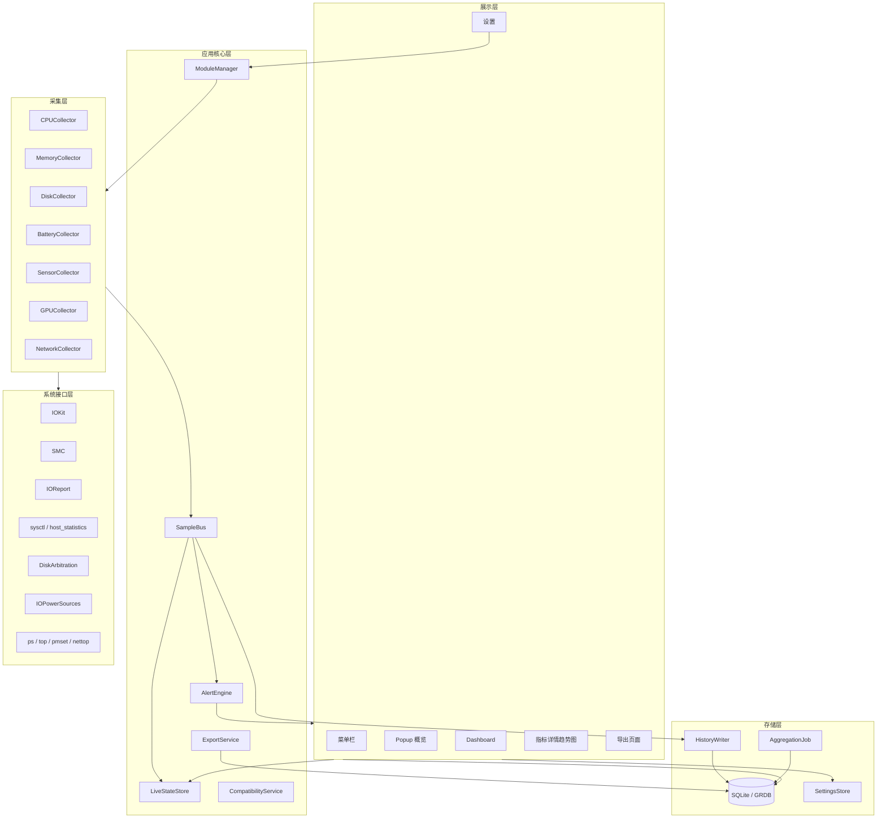
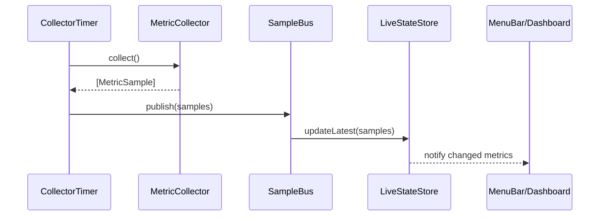
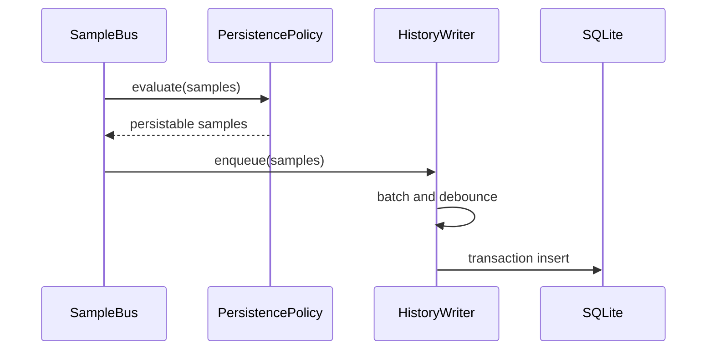
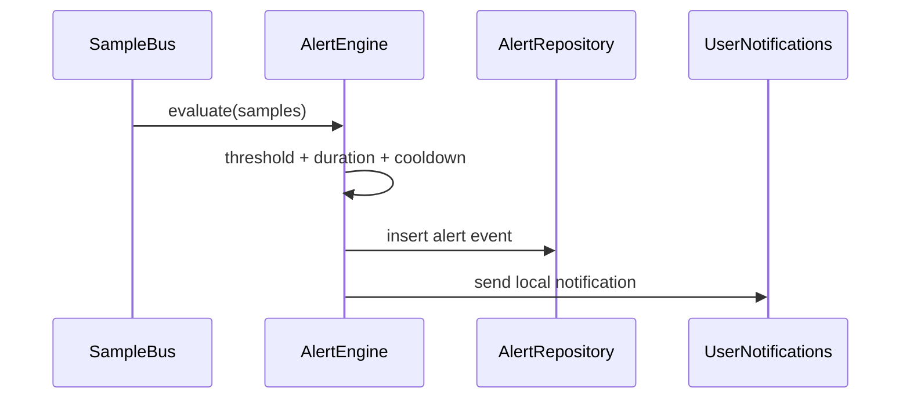
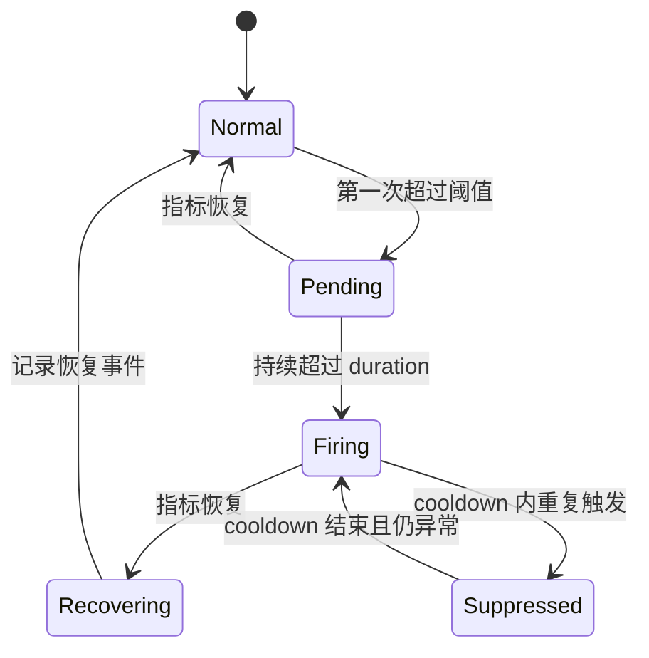
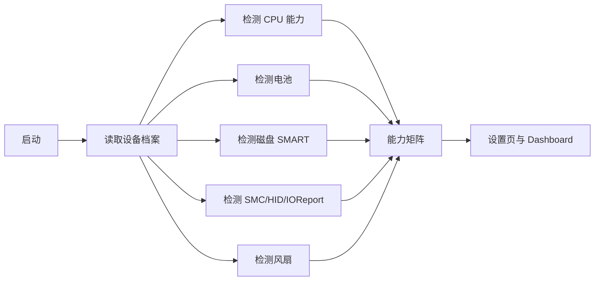

# MacWatch 技术架构文档

文档版本：v1.0  
项目名称：MacWatch  
目标平台：macOS 12 Monterey 及以上  
参考项目：Stats 源码  
编写日期：2026-06-08

## 1. 架构目标

MacWatch 的技术架构目标是在 macOS 上稳定、低能耗地采集硬件与系统资源指标，并将实时数据与长期历史数据同时服务于菜单栏、Dashboard、趋势图、告警和导出功能。

与 Stats 相比，MacWatch 的核心差异是：Stats 更偏实时菜单栏展示，MacWatch 更强调“记录变化过程”。因此架构必须把历史数据建模、写入、查询、聚合和清理作为核心能力，而不是只做短期缓存。

## 2. 架构原则

1. 采集与展示解耦：采集器不直接依赖具体 UI。
2. 实时与历史解耦：实时状态进入内存缓存，历史数据进入写入队列。
3. 高成本采集可控：传感器、SMART、进程级统计等应按需启用或降频。
4. 指标模型统一：不同模块的数据统一转换为 `MetricSample`。
5. 平台能力检测优先：不依赖硬编码机型假设。
6. 默认本地隐私：不默认上传指标，不默认启用远程服务。
7. 失败隔离：单个采集器失败不能影响其他模块。
8. 可扩展：后续可接入 GPU、网络、蓝牙、远程监控、Widget。

## 3. Stats 架构借鉴与改造

## 3.1 可借鉴部分

Stats 中可直接借鉴或重构复用的部分：

- `Module` 生命周期管理。
- `Reader` 定时采集机制。
- `Repeater` 定时器封装。
- `Store` 用户设置存储。
- CPU、RAM、Disk、Battery、Sensors、GPU 的底层采集实现。
- SMC 读取能力。
- SystemKit 设备识别能力。
- 菜单栏 Widget 思路。
- Popup 与设置页组织方式。
- 本地通知阈值配置思路。

## 3.2 必须改造部分

| Stats 设计 | MacWatch 改造 |
| --- | --- |
| Reader 同时负责采集、回调、DB 写入、Remote 发送 | Collector 只负责采集，数据通过 SampleBus 分发 |
| LevelDB 短期历史，TTL 约 1 小时 | SQLite/GRDB 长期时间序列存储 |
| 各模块数据模型相对独立 | 统一 `MetricSample`、`MetricDefinition`、`MetricScope` |
| UI 主要服务菜单栏 | 增加 Dashboard、详情页、趋势图、导出 |
| Remote 能力内置 | MVP 默认不启用远程能力 |
| 风扇控制能力存在 | MVP 只读风扇状态，不做控制 |

## 4. 推荐技术栈

| 层 | 技术 |
| --- | --- |
| 应用语言 | Swift |
| UI | SwiftUI + AppKit，菜单栏可使用 NSStatusItem |
| 图表 | Swift Charts；macOS 12 兼容时可封装自定义 Charts 或使用 AppKit 绘图 fallback |
| 数据库 | SQLite + GRDB.swift，或 SQLite.swift；不建议使用 LevelDB 作为主历史库 |
| 设置存储 | UserDefaults 封装 Store |
| 定时调度 | DispatchSourceTimer / Combine Timer / async Task，根据模块统一封装 |
| 系统信息 | IOKit、IOReport、SystemConfiguration、DiskArbitration、CoreWLAN、sysctl、host_statistics |
| 电池 | IOPowerSources、IORegistry `AppleSmartBattery` |
| 磁盘 | FileManager、statfs、DiskArbitration、IORegistry、NVMe SMART |
| 传感器 | SMC、IOHID、IOReport |
| 通知 | UserNotifications |
| 登录启动 | SMAppService 或 LaunchAtLogin Helper，根据最低系统版本选择 |
| 日志 | OSLog |
| 打包 | Developer ID 签名 + notarization |

## 5. 总体架构



## 6. 分层设计

## 6.1 展示层

展示层负责所有用户可见界面，不直接调用系统 API。

组件：

- `MenuBarController`：管理 NSStatusItem、菜单栏 Widget 和点击行为。
- `PopupView`：显示当前关键指标和最近告警。
- `DashboardView`：展示系统总览、趋势摘要和异常事件。
- `MetricDetailView`：展示单指标或多指标趋势图。
- `SettingsView`：设置模块、采样、存储、告警、菜单栏。
- `ExportView`：导出 CSV/JSON。

展示层只访问：

- `LiveStateStore` 获取当前值。
- `HistoryRepository` 获取历史曲线。
- `AlertRepository` 获取告警事件。
- `SettingsStore` 获取和修改设置。

## 6.2 应用核心层

应用核心层负责模块管理、数据分发、告警和兼容性。

### ModuleManager

职责：

- 加载所有模块定义。
- 根据用户设置启用/禁用采集器。
- 管理采集器生命周期。
- 处理应用启动、退出、睡眠、唤醒事件。
- 切换低功耗模式。

### SampleBus

职责：

- 接收所有采集器产生的 `MetricSample`。
- 将最新值发送到 `LiveStateStore`。
- 将需要持久化的数据发送到 `HistoryWriter`。
- 将样本发送到 `AlertEngine`。
- 提供订阅接口给 Dashboard 或 Popup。

### LiveStateStore

职责：

- 保存每个指标最新值。
- 保存最近短窗口数据，用于菜单栏迷你图。
- 向 UI 发布变更。
- 标记指标数据状态：正常、过期、不可用、读取失败。

### AlertEngine

职责：

- 加载告警规则。
- 检查样本是否超过阈值。
- 判断持续时间和冷却时间。
- 产生告警触发事件和恢复事件。
- 调用 UserNotifications 发出本地通知。

### CompatibilityService

职责：

- 检测当前设备支持哪些采集能力。
- 维护平台能力矩阵，例如 Intel、M1/M2/M3/M4、是否有电池、是否有风扇、是否支持 NVMe SMART。
- 向 UI 提供兼容性说明。
- 生成诊断报告。

## 6.3 采集层

采集层由多个 Collector 组成。Collector 与 Stats 中 Reader 类似，但职责更单一：采集原始数据并转换为统一指标样本。

推荐协议：

```swift
protocol MetricCollector: AnyObject {
    var id: String { get }
    var name: String { get }
    var defaultInterval: TimeInterval { get }
    var supported: Bool { get }
    var cost: CollectorCost { get }

    func setup() async throws
    func start()
    func stop()
    func pause()
    func resume()
    func collect() async throws -> [MetricSample]
}

enum CollectorCost: String {
    case low
    case medium
    case high
}
```

统一样本模型：

```swift
struct MetricSample: Codable, Hashable {
    let timestamp: Date
    let name: MetricName
    let value: Double
    let unit: MetricUnit
    let scope: MetricScope
    let source: MetricSource
    let quality: MetricQuality
    let attributes: [String: String]
}
```

## 6.4 存储层

存储层负责设置、历史样本、聚合数据、告警事件、设备档案。

组件：

- `SettingsStore`：UserDefaults 封装。
- `HistoryRepository`：历史样本查询接口。
- `HistoryWriter`：异步批量写入队列。
- `AggregationJob`：将原始数据聚合为分钟、小时、日级数据。
- `RetentionJob`：按保留策略删除或压缩旧数据。
- `AlertRepository`：告警事件存储。
- `DeviceProfileRepository`：设备档案存储。

## 7. 模块设计

## 7.1 CPUCollector

### 功能

- 采集 CPU 总使用率。
- 采集每核心使用率。
- 采集用户态、系统态、空闲态比例。
- 采集 CPU 温度。
- Apple Silicon 上采集效率核/性能核频率。
- 采集 1/5/15 分钟平均负载。
- 可选采集 CPU Top 进程。

### Stats 源码映射

| MacWatch 能力 | Stats 参考实现 |
| --- | --- |
| CPU 使用率 | `Modules/CPU/readers.swift` 的 `LoadReader` |
| 每核心使用率 | `LoadReader` 使用 `host_processor_info` |
| CPU 温度 | `TemperatureReader` 使用 SMC keys |
| CPU 频率 | `FrequencyReader` 使用 IOReport |
| 平均负载 | `AverageLoadReader` 使用 `uptime` |
| Top 进程 | `ProcessReader` 使用 `ps` |

### 输出指标

| 指标名 | 单位 | 说明 |
| --- | --- | --- |
| `cpu.usage.total` | `%` | CPU 总使用率 |
| `cpu.usage.user` | `%` | 用户态使用率 |
| `cpu.usage.system` | `%` | 系统态使用率 |
| `cpu.usage.idle` | `%` | 空闲比例 |
| `cpu.core.usage` | `%` | 单核心使用率，属性包含 `core_index` |
| `cpu.cluster.usage.efficiency` | `%` | 效率核使用率 |
| `cpu.cluster.usage.performance` | `%` | 性能核使用率 |
| `cpu.temperature.average` | `°C` | CPU 平均温度 |
| `cpu.temperature.hottest` | `°C` | CPU 最高温度 |
| `cpu.frequency.efficiency` | `MHz` | 效率核频率 |
| `cpu.frequency.performance` | `MHz` | 性能核频率 |
| `cpu.load.1m` | `load` | 1 分钟平均负载 |
| `cpu.load.5m` | `load` | 5 分钟平均负载 |
| `cpu.load.15m` | `load` | 15 分钟平均负载 |

## 7.2 MemoryCollector

### 功能

- 采集总内存、已用、可用。
- 采集 App、Wired、Compressed、Cache。
- 采集内存压力。
- 采集 Swap 使用。
- 可选采集 Top 内存进程。

### Stats 源码映射

| MacWatch 能力 | Stats 参考实现 |
| --- | --- |
| 内存统计 | `Modules/RAM/readers.swift` 的 `UsageReader` |
| 内存压力 | `sysctlbyname("kern.memorystatus_vm_pressure_level")` |
| Swap | `sysctlbyname("vm.swapusage")` |
| Top 进程 | `ProcessReader` 使用 `top` |

### 输出指标

| 指标名 | 单位 | 说明 |
| --- | --- | --- |
| `memory.usage.percent` | `%` | 内存使用率 |
| `memory.used.bytes` | `bytes` | 已用内存 |
| `memory.free.bytes` | `bytes` | 可用内存 |
| `memory.app.bytes` | `bytes` | App 内存 |
| `memory.wired.bytes` | `bytes` | Wired 内存 |
| `memory.compressed.bytes` | `bytes` | 压缩内存 |
| `memory.cache.bytes` | `bytes` | 缓存 |
| `memory.pressure.value` | `level` | 内存压力数值 |
| `memory.swap.used.bytes` | `bytes` | Swap 已用 |
| `memory.swap.total.bytes` | `bytes` | Swap 总量 |

## 7.3 DiskCollector

### 功能

- 枚举磁盘和卷。
- 采集容量、可用空间、使用率。
- 采集读写速率。
- 采集 SMART 温度和健康信息。
- 可选采集 I/O Top 进程。

### Stats 源码映射

| MacWatch 能力 | Stats 参考实现 |
| --- | --- |
| 卷枚举和容量 | `Modules/Disk/readers.swift` 的 `CapacityReader` |
| 磁盘活动 | `ActivityReader` 读取 IORegistry Statistics |
| SMART 温度 | `CapacityReader` 中 NVMe SMART 解析 |
| I/O Top 进程 | `ProcessReader` 使用 `proc_pid_rusage` |

### 输出指标

| 指标名 | 单位 | 说明 |
| --- | --- | --- |
| `disk.capacity.total` | `bytes` | 总容量 |
| `disk.capacity.free` | `bytes` | 可用容量 |
| `disk.capacity.used_percent` | `%` | 使用率 |
| `disk.io.read.bytes_per_sec` | `bytes/s` | 读速率 |
| `disk.io.write.bytes_per_sec` | `bytes/s` | 写速率 |
| `disk.temperature.smart` | `°C` | SMART 温度 |
| `disk.smart.life_percent` | `%` | 设备寿命，支持时展示 |
| `disk.smart.power_on_hours` | `hours` | 通电小时，支持时展示 |

属性应包含：`disk_uuid`、`bsd_name`、`mount_path`、`filesystem`、`connection_type`。

## 7.4 BatteryCollector

### 功能

- 采集电量和电源状态。
- 采集电池温度。
- 采集循环次数和健康状态。
- 采集设计容量、最大容量、当前容量。
- 采集电压、电流、充电功率。
- 采集预计剩余时间和充满时间。
- 可选采集高能耗进程。

### Stats 源码映射

| MacWatch 能力 | Stats 参考实现 |
| --- | --- |
| 电源状态 | `Modules/Battery/readers.swift` 的 `UsageReader` |
| 电池温度 | IORegistry `AppleSmartBattery` Temperature |
| 容量和循环 | IORegistry `AppleSmartBattery` |
| 外接电源 | `IOPSCopyExternalPowerAdapterDetails` |
| 高能耗进程 | `ProcessReader` 使用 `top -o power` |

### 输出指标

| 指标名 | 单位 | 说明 |
| --- | --- | --- |
| `battery.level.percent` | `%` | 电量 |
| `battery.temperature` | `°C` | 电池温度 |
| `battery.cycle_count` | `count` | 循环次数 |
| `battery.health.percent` | `%` | 最大容量 / 设计容量 |
| `battery.capacity.design` | `mAh` | 设计容量 |
| `battery.capacity.max` | `mAh` | 最大容量 |
| `battery.capacity.current` | `mAh` | 当前容量 |
| `battery.voltage` | `V` | 电压 |
| `battery.current` | `A` | 电流 |
| `battery.power` | `W` | 功率，可由电压电流计算或系统提供 |
| `battery.time_to_empty` | `seconds` | 预计剩余使用时间 |
| `battery.time_to_full` | `seconds` | 预计充满时间 |

状态变化可通过事件表记录，例如 `charging_started`、`charging_stopped`、`power_adapter_connected`、`power_adapter_disconnected`。

## 7.5 SensorCollector

### 功能

- 枚举 SMC 传感器。
- 读取温度、电压、电流、功率、风扇。
- Apple Silicon 上读取 HID sensors。
- Apple Silicon 上通过 IOReport 读取或估算功耗。
- 计算派生指标：最高 CPU 温度、平均 CPU 温度、最高 GPU 温度、系统总功耗、最快风扇。

### Stats 源码映射

| MacWatch 能力 | Stats 参考实现 |
| --- | --- |
| 传感器模型 | `Modules/Sensors/values.swift` |
| SMC 传感器读取 | `Modules/Sensors/readers.swift` + `SMC/smc.swift` |
| HID 传感器 | `AppleSiliconSensors` 相关实现 |
| IOReport 功耗 | `SensorsReader` 的 Energy Model 读取逻辑 |
| 风扇读取 | SMC keys `FNum`、`FxAc`、`FxMn`、`FxMx` 等 |

### 输出指标

| 指标名 | 单位 | 说明 |
| --- | --- | --- |
| `sensor.temperature` | `°C` | 单个温度传感器，属性包含 sensor_key |
| `sensor.voltage` | `V` | 单个电压传感器 |
| `sensor.current` | `A` | 单个电流传感器 |
| `sensor.power` | `W` | 单个功率传感器 |
| `fan.speed.rpm` | `rpm` | 单风扇转速 |
| `fan.speed.fastest_rpm` | `rpm` | 当前最快风扇 |
| `system.power.total` | `W` | 系统总功耗 |
| `cpu.temperature.hottest` | `°C` | 派生指标 |
| `gpu.temperature.hottest` | `°C` | 派生指标 |

## 7.6 GPUCollector

GPUCollector 可作为 MVP+ 模块。

### 功能

- 采集 GPU 使用率。
- 采集 Renderer/Tiler 使用率。
- 采集 GPU 温度。
- 采集 GPU/ANE 功耗或利用率。
- 采集 FPS，设备支持时展示。

### Stats 源码映射

| MacWatch 能力 | Stats 参考实现 |
| --- | --- |
| GPU 使用率 | `Modules/GPU/reader.swift` 的 `InfoReader` |
| PerformanceStatistics | IORegistry `IOAccelerator` |
| Apple Silicon ANE/FPS | IOReport 和 DCP channels |
| GPU 温度 fallback | SMC keys |

## 8. 数据流设计

## 8.1 实时数据流



## 8.2 历史写入流



## 8.3 告警流



## 9. 统一指标命名规范

命名格式：

```text
<domain>.<category>.<metric>[.<variant>]
```

示例：

- `cpu.usage.total`
- `cpu.usage.user`
- `cpu.temperature.average`
- `cpu.temperature.hottest`
- `memory.usage.percent`
- `memory.pressure.value`
- `disk.capacity.free`
- `disk.io.read.bytes_per_sec`
- `disk.temperature.smart`
- `battery.level.percent`
- `battery.temperature`
- `fan.speed.rpm`
- `system.power.total`

命名规则：

- 全部小写。
- 使用点分层。
- 单位不写入指标名，单位由 `unit` 字段承载。
- 设备实例差异放入 `scope` 或 `attributes`，不拼接到指标名。
- 指标名必须稳定，避免 UI 和历史查询因名称变化失效。

## 10. 数据库设计

建议使用 SQLite + GRDB。数据库文件位于：

```text
~/Library/Application Support/MacWatch/macwatch.sqlite
```

## 10.1 表：`metric_sample`

保存原始采样数据。

```sql
CREATE TABLE metric_sample (
    id INTEGER PRIMARY KEY AUTOINCREMENT,
    timestamp_ms INTEGER NOT NULL,
    metric_name TEXT NOT NULL,
    value REAL NOT NULL,
    unit TEXT NOT NULL,
    scope_type TEXT NOT NULL,
    scope_id TEXT,
    source TEXT NOT NULL,
    quality TEXT NOT NULL,
    attributes_json TEXT,
    created_at_ms INTEGER NOT NULL
);

CREATE INDEX idx_metric_sample_name_time
ON metric_sample(metric_name, timestamp_ms);

CREATE INDEX idx_metric_sample_scope_time
ON metric_sample(scope_type, scope_id, timestamp_ms);
```

字段说明：

| 字段 | 说明 |
| --- | --- |
| `timestamp_ms` | 指标发生时间 |
| `metric_name` | 统一指标名 |
| `value` | 数值 |
| `unit` | 单位 |
| `scope_type` | system、cpu_core、disk、battery、fan、sensor 等 |
| `scope_id` | 实例 ID，例如 core index、disk UUID、sensor key |
| `source` | 数据来源，例如 SMC、IOKit、IOReport、SMART |
| `quality` | valid、unsupported、readFailed、estimated 等 |
| `attributes_json` | 扩展属性 |

## 10.2 表：`metric_aggregate_minute`

分钟级聚合数据。

```sql
CREATE TABLE metric_aggregate_minute (
    bucket_start_ms INTEGER NOT NULL,
    metric_name TEXT NOT NULL,
    scope_type TEXT NOT NULL,
    scope_id TEXT,
    min_value REAL NOT NULL,
    max_value REAL NOT NULL,
    avg_value REAL NOT NULL,
    count INTEGER NOT NULL,
    unit TEXT NOT NULL,
    PRIMARY KEY(bucket_start_ms, metric_name, scope_type, scope_id)
);
```

## 10.3 表：`metric_aggregate_hour`

小时级聚合数据。

```sql
CREATE TABLE metric_aggregate_hour (
    bucket_start_ms INTEGER NOT NULL,
    metric_name TEXT NOT NULL,
    scope_type TEXT NOT NULL,
    scope_id TEXT,
    min_value REAL NOT NULL,
    max_value REAL NOT NULL,
    avg_value REAL NOT NULL,
    count INTEGER NOT NULL,
    unit TEXT NOT NULL,
    PRIMARY KEY(bucket_start_ms, metric_name, scope_type, scope_id)
);
```

## 10.4 表：`alert_event`

保存告警触发、恢复、忽略事件。

```sql
CREATE TABLE alert_event (
    id INTEGER PRIMARY KEY AUTOINCREMENT,
    started_at_ms INTEGER NOT NULL,
    ended_at_ms INTEGER,
    metric_name TEXT NOT NULL,
    scope_type TEXT NOT NULL,
    scope_id TEXT,
    rule_id TEXT NOT NULL,
    threshold_value REAL NOT NULL,
    peak_value REAL NOT NULL,
    unit TEXT NOT NULL,
    status TEXT NOT NULL,
    message TEXT NOT NULL,
    created_at_ms INTEGER NOT NULL
);

CREATE INDEX idx_alert_event_time
ON alert_event(started_at_ms, ended_at_ms);
```

## 10.5 表：`device_profile`

保存设备档案和兼容性信息。

```sql
CREATE TABLE device_profile (
    id TEXT PRIMARY KEY,
    created_at_ms INTEGER NOT NULL,
    updated_at_ms INTEGER NOT NULL,
    model TEXT,
    chip TEXT,
    architecture TEXT,
    os_version TEXT,
    cpu_json TEXT,
    gpu_json TEXT,
    memory_json TEXT,
    disk_json TEXT,
    capability_json TEXT
);
```

## 10.6 表：`collector_status`

保存采集器运行状态，便于诊断。

```sql
CREATE TABLE collector_status (
    collector_id TEXT PRIMARY KEY,
    enabled INTEGER NOT NULL,
    supported INTEGER NOT NULL,
    last_success_at_ms INTEGER,
    last_failure_at_ms INTEGER,
    last_error TEXT,
    interval_seconds REAL NOT NULL,
    updated_at_ms INTEGER NOT NULL
);
```

## 11. 历史写入策略

## 11.1 写入队列

`HistoryWriter` 应使用单独串行队列或 actor，避免多线程同时写 SQLite。

策略：

- 样本进入内存队列。
- 达到批量阈值或时间阈值后写入。
- 写入使用事务。
- 写入失败时重试有限次数。
- 队列过长时可丢弃部分高频样本，但必须记录丢弃事件。

建议默认参数：

| 参数 | 默认值 |
| --- | --- |
| 最大批量 | 200 条 |
| 最大延迟 | 5 秒 |
| 失败重试 | 3 次 |
| 队列上限 | 10,000 条 |

## 11.2 降采样

为避免数据库膨胀，应定期生成聚合数据：

- 原始数据用于最近几天细节查询。
- 分钟聚合用于最近几个月查询。
- 小时聚合用于长期趋势。

聚合任务可在以下时机运行：

- 应用启动后延迟运行。
- 每小时运行一次。
- 应用空闲时运行。
- 用户手动清理时运行。

## 11.3 数据缺口

Mac 睡眠时无法采集数据。系统应记录数据缺口，而不是用前值填充。

实现方式：

- 监听睡眠/唤醒通知。
- 唤醒后插入 `system.sleep.end` 事件或在事件表记录缺口。
- 趋势图中显示断点。

## 12. 查询设计

`HistoryRepository` 提供统一查询接口。

```swift
struct MetricQuery {
    let metricNames: [MetricName]
    let scopes: [MetricScope]?
    let start: Date
    let end: Date
    let resolution: QueryResolution
}

enum QueryResolution {
    case raw
    case auto
    case minute
    case hour
    case day
}
```

自动分辨率策略：

| 查询范围 | 默认数据源 |
| --- | --- |
| 0 - 6 小时 | 原始数据 |
| 6 - 48 小时 | 原始数据或分钟聚合 |
| 2 - 30 天 | 分钟聚合 |
| 30 天以上 | 小时聚合 |

趋势图不应直接渲染超过约 2,000 个点。超过时必须降采样或聚合。

## 13. 告警引擎设计

## 13.1 告警规则模型

```swift
struct AlertRule: Codable, Identifiable {
    let id: String
    let metricName: MetricName
    let scopeFilter: MetricScopeFilter?
    let comparison: AlertComparison
    let threshold: Double
    let duration: TimeInterval
    let cooldown: TimeInterval
    let enabled: Bool
    let severity: AlertSeverity
}
```

比较方式：

- `greaterThan`
- `greaterThanOrEqual`
- `lessThan`
- `lessThanOrEqual`
- `equal`
- `notEqual`

告警状态机：



## 13.2 默认告警规则

| 规则 ID | 指标 | 阈值 | 持续时间 | 冷却时间 |
| --- | --- | --- | --- | --- |
| `cpu_temperature_high` | `cpu.temperature.hottest` | > 90°C | 60 秒 | 10 分钟 |
| `battery_temperature_high` | `battery.temperature` | > 40°C | 60 秒 | 10 分钟 |
| `disk_temperature_high` | `disk.temperature.smart` | > 60°C | 120 秒 | 30 分钟 |
| `memory_pressure_high` | `memory.pressure.value` | >= warning | 60 秒 | 10 分钟 |
| `disk_space_low` | `disk.capacity.used_percent` | > 90% | 300 秒 | 60 分钟 |
| `cpu_usage_sustained_high` | `cpu.usage.total` | > 90% | 300 秒 | 15 分钟 |

## 14. 采集调度设计

## 14.1 调度器

推荐实现 `CollectorScheduler`，负责：

- 为每个 Collector 建立定时任务。
- 支持不同采样间隔。
- 支持动态调整间隔。
- 支持暂停、恢复和停止。
- 支持低功耗模式。
- 支持窗口可见性驱动的采样频率调整。

## 14.2 低功耗策略

| 场景 | 策略 |
| --- | --- |
| 菜单栏可见，主窗口关闭 | 保持核心指标，降低详情指标频率 |
| Popup 打开 | 临时提高相关指标刷新频率 |
| Dashboard 打开 | 保持中高频刷新 |
| 详情页打开 | 相关指标提高刷新频率，其余保持默认 |
| 电池供电 | 可启用低功耗配置 |
| 系统睡眠 | 停止采集，记录缺口 |
| 系统唤醒 | 重新 setup 可能失效的采集器 |

## 15. 系统接口层设计

## 15.1 CPU

数据来源：

- `host_processor_info(PROCESSOR_CPU_LOAD_INFO)`：每核心 CPU ticks。
- `host_statistics(HOST_CPU_LOAD_INFO)`：系统级 CPU ticks。
- SMC keys：Intel 和部分 Apple Silicon 温度。
- IOReport：Apple Silicon CPU 频率和功耗。
- `/usr/bin/uptime`：平均负载。

注意事项：

- CPU ticks 需要与上一次采样做差分。
- 超线程核心可选择合并展示。
- Apple Silicon 应按 E-Core、P-Core、S-Core 分组。
- 温度传感器可能因机型不同而缺失。

## 15.2 内存

数据来源：

- `host_info(HOST_BASIC_INFO)`：总内存。
- `host_statistics64(HOST_VM_INFO64)`：VM 统计。
- `sysctlbyname("kern.memorystatus_vm_pressure_level")`：内存压力。
- `sysctlbyname("vm.swapusage")`：Swap。

注意事项：

- 内存分类的计算方式需固定，避免 UI 前后不一致。
- 内存压力等级应以系统值为准。

## 15.3 磁盘

数据来源：

- FileManager mounted volumes。
- DiskArbitration。
- `statfs`。
- IORegistry `IOBlockStorageDevice`。
- NVMe SMART log。
- `proc_pid_rusage` 用于进程级 I/O。

注意事项：

- APFS 容器与卷的容量显示需明确。
- 外接盘可能没有 SMART 温度。
- 读写速率需要使用累计值差分。
- 磁盘唯一标识应优先使用 UUID，缺失时使用 BSD Name + mount path fallback。

## 15.4 电池

数据来源：

- `IOPSCopyPowerSourcesInfo`。
- `IOPSCopyPowerSourcesList`。
- `IOPSGetPowerSourceDescription`。
- IORegistry `AppleSmartBattery`。
- `IOPSCopyExternalPowerAdapterDetails`。
- `IOPSNotificationCreateRunLoopSource`。

注意事项：

- 无电池设备应自动禁用 BatteryCollector。
- 电池温度单位需要换算为摄氏度。
- 电流可能有正负方向，应统一含义。
- 电源状态变化应立即采集并记录事件。

## 15.5 传感器与风扇

数据来源：

- SMC keys。
- IOHID sensors。
- IOReport Energy Model。
- SMC fan keys。

注意事项：

- 初始枚举可较慢，启动后异步执行。
- 传感器列表应缓存。
- 读取异常值需要过滤，例如明显不合理温度。
- 传感器名称需要通过适配表标准化。
- 风扇控制能力不纳入 MVP。

## 16. 权限、签名与沙盒

## 16.1 沙盒策略

MacWatch 如果需要读取底层硬件信息，完整 Mac App Sandbox 可能限制部分 IOKit/SMC 能力。建议根据发布渠道决定：

- 若通过官网分发：Developer ID 签名 + notarization，非 Mac App Store 沙盒限制更少。
- 若通过 Mac App Store：需要重新评估 SMC、IORegistry、SMART 等能力是否可用。

## 16.2 Helper 策略

MVP 不需要 privileged helper，因为默认只读监控。只有在未来实现风扇控制或需要额外权限读取特定硬件数据时，才引入 helper。

若引入 helper，要求：

- 使用 SMJobBless 或现代替代方案。
- XPC 接口最小化。
- 明确签名校验。
- 用户显式授权安装。
- 提供卸载能力。
- 所有控制操作记录日志。

## 17. 项目目录建议

```text
MacWatch/
  App/
    MacWatchApp.swift
    AppDelegate.swift
    Lifecycle/
  Core/
    ModuleManager.swift
    SampleBus.swift
    LiveStateStore.swift
    CompatibilityService.swift
    MetricName.swift
    MetricSample.swift
    MetricDefinition.swift
  Collectors/
    CPU/
      CPUCollector.swift
      CPUTemperatureReader.swift
      CPUFrequencyReader.swift
    Memory/
      MemoryCollector.swift
    Disk/
      DiskCollector.swift
      DiskSMARTReader.swift
      DiskActivityReader.swift
    Battery/
      BatteryCollector.swift
    Sensors/
      SensorCollector.swift
      SMCClient.swift
      HIDSensorReader.swift
      IOReportReader.swift
    GPU/
      GPUCollector.swift
    Network/
      NetworkCollector.swift
  Storage/
    Database.swift
    HistoryWriter.swift
    HistoryRepository.swift
    AggregationJob.swift
    RetentionJob.swift
    AlertRepository.swift
    DeviceProfileRepository.swift
  Alerts/
    AlertRule.swift
    AlertEngine.swift
    NotificationService.swift
  UI/
    MenuBar/
    Popup/
    Dashboard/
    MetricDetail/
    Settings/
    Export/
  Services/
    ExportService.swift
    DiagnosticsService.swift
    LaunchAtLoginService.swift
  Resources/
    MetricDefinitions.json
    SensorNames.json
  Tests/
    CollectorTests/
    StorageTests/
    AlertTests/
    UITests/
```

## 18. 从 Stats 迁移的实施路径

## 18.1 第一阶段：抽取公共能力

从 Stats 抽取或重写以下能力：

- `Repeater` 定时器封装。
- `Store` 设置封装。
- `SystemKit` 设备信息识别。
- SMC 读取基础能力。
- CPU/RAM/Battery/Disk 的基础 Reader。

输出：基础 Collector 可在命令行或测试中输出统一 `MetricSample`。

## 18.2 第二阶段：统一指标模型

将 Stats 各模块独立模型转换为 MacWatch 的统一样本：

- `CPU_Load` -> 多条 `cpu.*` 样本。
- `RAM_Usage` -> 多条 `memory.*` 样本。
- `drive` -> 多条 `disk.*` 样本。
- `Battery_Usage` -> 多条 `battery.*` 样本。
- `Sensor` / `Fan` -> 多条 `sensor.*` / `fan.*` 样本。

输出：所有采集器只向 SampleBus 发布统一样本。

## 18.3 第三阶段：替换历史存储

不沿用 Stats 的 LevelDB 短期 TTL 作为主存储，改为：

- SQLite 原始样本表。
- 聚合表。
- 告警事件表。
- 设备档案表。
- 采集器状态表。

输出：可查询最近 24 小时和最近 7 天数据。

## 18.4 第四阶段：构建 UI

先实现：

- 菜单栏显示。
- Popup 概览。
- Dashboard。
- 指标详情趋势图。
- 设置页。

输出：完整 MVP 可用闭环。

## 18.5 第五阶段：增强能力

后续接入：

- GPUCollector。
- 网络指标。
- macOS Widget。
- 远程监控。
- 进程级长期记录。
- 诊断报告。

## 19. 错误处理策略

## 19.1 错误分类

| 错误类型 | 处理方式 |
| --- | --- |
| 指标不支持 | 标记 `unsupported`，UI 显示原因 |
| 权限不足 | 标记 `permissionDenied`，提示授权或说明限制 |
| 单次读取失败 | 标记 `readFailed`，保留上一值但显示过期状态 |
| 连续读取失败 | 暂停采集器并记录 collector_status |
| 数据库写入失败 | 重试，失败后记录日志并停止历史写入，不影响实时展示 |
| 数据异常值 | 丢弃或标记 `invalid`，记录诊断日志 |

## 19.2 数据质量状态

```swift
enum MetricQuality: String, Codable {
    case valid
    case unsupported
    case permissionDenied
    case readFailed
    case stale
    case estimated
    case invalid
}
```

UI 不应把非 `valid` 或 `estimated` 的数据当作正常实时值展示。

## 20. 日志与诊断

MacWatch 应使用 OSLog 记录关键事件：

- App 启动和退出。
- 采集器启用、禁用、失败。
- 数据库迁移。
- 历史写入失败。
- 告警触发和恢复。
- 睡眠和唤醒。
- 传感器枚举结果。

诊断报告应包含：

- 应用版本。
- macOS 版本。
- 设备型号和芯片架构。
- 可用采集器列表。
- 不可用指标原因。
- 最近错误日志摘要。
- 数据库大小和保留策略。

## 21. 测试策略

## 21.1 单元测试

- 指标转换测试。
- 阈值告警状态机测试。
- 数据库写入和查询测试。
- 聚合逻辑测试。
- 数据保留策略测试。
- 单位换算测试。

## 21.2 集成测试

- CPUCollector 在 Intel/Apple Silicon 上采集。
- MemoryCollector 采集和压力状态读取。
- DiskCollector 对 APFS、外接盘、无 SMART 情况处理。
- BatteryCollector 在有电池和无电池设备上的行为。
- SensorCollector 在不同芯片系列上的传感器枚举。
- 睡眠/唤醒恢复。

## 21.3 性能测试

- 默认配置下 24 小时运行 CPU/内存占用。
- 高频采样时数据库写入吞吐。
- 30 天数据趋势查询性能。
- Dashboard 打开耗时。
- 传感器扫描耗时。

## 21.4 回归测试

每次更新采集器或数据库 schema 后，必须验证：

- 应用可启动。
- 历史数据可迁移。
- 旧设置可读取。
- 不支持指标不会导致崩溃。

## 22. 性能优化策略

1. 使用批量写入减少磁盘 I/O。
2. 趋势图按时间范围选择聚合粒度。
3. 高成本采集器按需启用。
4. 传感器列表缓存，避免频繁全量枚举。
5. UI 使用最新值缓存，避免每次刷新查询数据库。
6. 告警引擎只处理订阅的规则指标。
7. 进程级统计默认关闭或低频采集。
8. 电池供电时启用低功耗配置。

## 23. 安全与隐私设计

- 历史数据仅保存在本地。
- 不默认连接远程监控服务。
- 不记录用户具体文件访问路径。
- 不记录浏览器访问 URL 或网络内容。
- 导出前提示可能包含设备型号、磁盘名称和传感器 key。
- 如后续增加远程监控，必须显式授权、可随时关闭，并提供数据删除说明。

## 24. 兼容性设计

## 24.1 平台矩阵

| 平台 | 支持策略 |
| --- | --- |
| Intel Mac | 支持 CPU/RAM/Disk/Battery/SMC，部分 GPU 指标依设备而定 |
| Apple Silicon M1/M2/M3/M4 | 支持 CPU/RAM/Disk/Battery/SMC/HID/IOReport，具体传感器按能力检测 |
| 无电池 Mac | BatteryCollector 自动禁用 |
| 无风扇 Mac | Fan 指标不可用，不显示风扇告警 |
| 外接磁盘 | 容量和 I/O 支持，温度视设备而定 |

## 24.2 能力检测

启动时执行能力检测：



## 25. 构建与发布

建议发布方式：

- 官网下载分发。
- Developer ID 签名。
- Apple notarization。
- 自动更新可后续接入 Sparkle。

发布前检查：

- 开源许可证声明。
- 第三方依赖许可证。
- SMC/IOKit 能力在目标 macOS 上验证。
- 首次启动无非必要外部请求。
- 数据库迁移测试。

## 26. 开源许可注意事项

如果 MacWatch 基于 Stats 源码开发，需要遵守 Stats 项目的开源许可证要求。应在项目中保留相应版权声明、许可证文本和修改说明。所有从 Stats 迁移的源码应在文件头或许可证说明中明确来源与改动。

## 27. MVP 技术交付清单

| 交付项 | 内容 |
| --- | --- |
| Collector 框架 | `MetricCollector`、`CollectorScheduler`、`SampleBus` |
| 基础采集器 | CPU、Memory、Disk、Battery、Sensor |
| 数据模型 | `MetricSample`、`MetricName`、`MetricUnit`、`MetricScope` |
| 历史存储 | SQLite schema、HistoryWriter、HistoryRepository |
| UI | MenuBar、Popup、Dashboard、MetricDetail、Settings |
| 告警 | AlertRule、AlertEngine、UserNotifications |
| 导出 | CSV/JSON ExportService |
| 兼容性 | CompatibilityService、诊断页面 |
| 测试 | 单元测试、基础集成测试、24 小时稳定性测试 |

## 28. 结论

MacWatch 应以 Stats 的硬件采集能力为基础，但架构上应围绕“长期记录与趋势分析”重新组织。推荐采用 Collector + SampleBus + LiveStateStore + HistoryWriter + SQLite 的架构，以保证实时展示轻量、历史数据可靠、趋势查询高效、告警逻辑清晰。

第一版应聚焦 CPU、内存、磁盘、电池、传感器和风扇，只读监控，不做远程服务和风扇控制。这样可以最大化复用 Stats 的成熟代码，同时降低权限、安全、隐私和维护风险。
