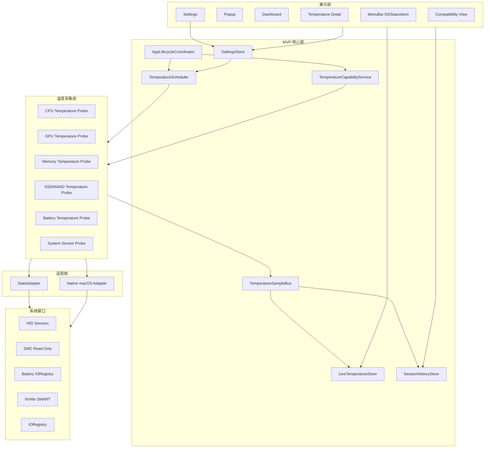
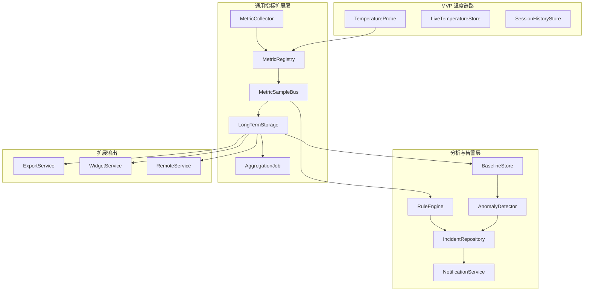

# MacWatch 技术架构文档

## 索引目录（大模型检索用）

> 使用方式：先按本索引定位需要章节，再只读取对应标题下的片段，避免把整篇文档塞入上下文。

- [文档元信息](#macwatch-技术架构文档)：查看版本、平台、Stats 参考位置和修订日期。
- [1. 架构目标与阶段划分](#1-架构目标与阶段划分)：确认 MVP 与 Post-MVP 的架构边界。
  - [1.1 MVP 架构目标](#11-mvp-架构目标)：实现温度主链路前读取。
  - [1.2 Post-MVP 架构目标](#12-post-mvp-架构目标)：判断某扩展是否应延后时读取。
  - [1.3 明确禁止混入 MVP 的能力](#13-明确禁止混入-mvp-的能力)：防止引入 Remote、DB、通知、helper、风扇控制等能力。
- [2. MVP 架构原则](#2-mvp-架构原则)：做分层设计、依赖方向和失败隔离时读取。
- [3. Stats 源码复用边界](#3-stats-源码复用边界)：处理 `Vendor/Stats`、`StatsAdapter` 和迁移代码时优先读取。
  - [3.1 可以复用或移植的内容](#31-可以复用或移植的内容)：确认可参考的只读采集逻辑。
  - [3.2 禁止直接复用的内容](#32-禁止直接复用的内容)：确认不能进入默认链路的 Stats 能力。
  - [3.3 StatsAdapter 职责](#33-statsadapter-职责)：设计适配层接口、职责和禁止事项时读取。
- [4. MVP 总体架构](#4-mvp-总体架构)：理解模块分层、依赖关系和端到端数据流时读取。
- [5. 温度采集与能力检测](#5-温度采集与能力检测)：实现采集、能力检测、状态建模和样本模型时读取。
  - [5.1 温度领域](#51-温度领域)：定义硬件指标、传感器指标和领域概念时读取。
  - [5.2 温度来源](#52-温度来源)：选择 HID、SMC、IORegistry、SMART 等来源时读取。
  - [5.3 温度状态](#53-温度状态)：实现 `ok`、`unsupported`、`readFailed`、`stale` 状态时读取。
  - [5.4 能力检测模型](#54-能力检测模型)：保存能力结果和可用性说明时读取。
  - [5.5 温度样本模型](#55-温度样本模型)：设计 `TemperatureSample` 字段和状态语义时读取。
- [6. 实时状态、会话历史和趋势查询](#6-实时状态会话历史和趋势查询)：实现 store、repository、数据缺口和查询接口时读取。
  - [6.1 实时状态](#61-实时状态)：实现当前温度状态和 UI 订阅时读取。
  - [6.2 会话历史](#62-会话历史)：实现本次运行会话存储时读取。
  - [6.3 数据缺口](#63-数据缺口)：处理睡眠、暂停、失败和趋势断线时读取。
  - [6.4 查询接口](#64-查询接口)：实现趋势范围查询和降采样时读取。
- [7. UI 分层与 macOS 桌面结构](#7-ui-分层与-macos-桌面结构)：实现 App、菜单栏、Popup、Dashboard 和展示层访问规则时读取。
  - [7.1 场景结构](#71-场景结构)：设计 macOS scene、window 和 menu bar 结构时读取。
  - [7.2 展示层访问规则](#72-展示层访问规则)：防止 UI 直接访问系统采集、数据库或 Vendor 代码。
  - [7.3 MVP 页面责任](#73-mvp-页面责任)：拆分页面职责和视图模型时读取。
- [8. MVP 数据库设计](#8-mvp-数据库设计)：设计 SQLite 表、迁移和 repository 时读取。
  - [8.1 `monitoring_session`](#81-monitoring_session)：实现运行会话表时读取。
  - [8.2 `temperature_sample`](#82-temperature_sample)：实现温度样本表时读取。
  - [8.3 `temperature_capability`](#83-temperature_capability)：实现能力检测持久化时读取。
  - [8.4 `timeline_event`](#84-timeline_event)：记录睡眠、暂停、恢复等时间线事件时读取。
- [9. 采样、调度、低功耗和睡眠唤醒](#9-采样调度低功耗和睡眠唤醒)：实现采样器、调度器和高成本采集限制时读取。
  - [9.1 默认采样策略](#91-默认采样策略)：确认刷新频率和写入节奏。
  - [9.2 调度器职责](#92-调度器职责)：实现周期调度、暂停恢复和状态广播时读取。
  - [9.3 高成本采集约束](#93-高成本采集约束)：限制 SMART 等高成本读取时读取。
- [10. 隐私、安全、权限和联网隔离](#10-隐私安全权限和联网隔离)：核对本地处理、沙盒、helper 和联网边界时读取。
  - [10.1 MVP 隐私规则](#101-mvp-隐私规则)：确认不记录用户内容和不上传。
  - [10.2 沙盒与分发](#102-沙盒与分发)：处理 macOS 沙盒、权限和分发时读取。
  - [10.3 Helper 策略](#103-helper-策略)：确认不引入 privileged helper 和 SMC 写操作。
- [11. Post-MVP 扩展架构](#11-post-mvp-扩展架构)：讨论长期历史、资源监控、告警、Widget 等扩展时读取。
- [12. 硬件范围扩展策略](#12-硬件范围扩展策略)：扩展到更多 Mac 或外设时读取。
  - [12.1 扩展原则](#121-扩展原则)：确认扩展不能破坏 MVP 温度链路。
  - [12.2 后续硬件类型](#122-后续硬件类型)：判断新增硬件类型归属时读取。
- [13. 资源消耗监控扩展策略](#13-资源消耗监控扩展策略)：设计 CPU、GPU、内存、磁盘、网络等资源监控扩展时读取。
- [14. 异常识别、分析和告警扩展策略](#14-异常识别分析和告警扩展策略)：设计异常检测和告警系统时读取。
  - [14.1 组件职责](#141-组件职责)：拆分分析器、规则、事件和通知职责时读取。
  - [14.2 异常类型](#142-异常类型)：定义温度、功耗、资源压力等异常类型时读取。
  - [14.3 告警事件模型](#143-告警事件模型)：设计告警事件字段和生命周期时读取。
- [15. 项目目录建议](#15-项目目录建议)：创建或移动源码文件前读取。
- [16. 测试和验收标准](#16-测试和验收标准)：开发完成前核对文档一致性、边界、MVP 功能和扩展性。
  - [16.1 文档一致性验收](#161-文档一致性验收)：核对需求、架构和实现是否一致。
  - [16.2 Stats 复用边界验收](#162-stats-复用边界验收)：核对 Stats 禁用能力是否未接入。
  - [16.3 MVP 功能验收](#163-mvp-功能验收)：核对温度链路、状态展示和趋势查询。
  - [16.4 扩展性验收](#164-扩展性验收)：核对扩展点不污染 MVP 链路。
- [17. 架构风险与应对](#17-架构风险与应对)：评估系统 API、硬件差异、能耗和扩展风险时读取。
- [18. 结论](#18-结论)：快速确认架构取舍和总体方向。

文档版本：v2.0
项目名称：MacWatch
目标平台：macOS 12 Monterey 及以上
参考项目：Stats 源码，固定在 `Vendor/Stats`
编写日期：2026-06-08
修订日期：2026-06-10

## 1. 架构目标与阶段划分

MacWatch 的架构采用分层演进策略：MVP 只实现 Apple Silicon MacBook Air 上的本机温度监控和本次运行会话内的温度趋势；后续版本再扩展到更多硬件类型、系统资源消耗、长期历史、异常识别、分析、告警、导出、远程监控和 Widget。

这样划分的原因是 Stats 的能力范围很广，但 Stats 本身是完整菜单栏系统监控 App，不是稳定的采集 SDK。MacWatch 第一阶段必须先把温度采集、能力检测、状态展示、会话历史和趋势图这条主链路做稳定，不能把 Stats 的 Remote、LevelDB、通知、Updater、进程统计、风扇控制等能力提前带入 MVP。

### 1.1 MVP 架构目标

MVP 只解决以下问题：

1. 在 MacBook Air M 系列设备上采集 CPU、GPU、内存、内置 SSD/NAND、电池中可读取的温度。
2. 对不可读取的温度指标明确展示 `unsupported` 或 `readFailed`，不能隐藏或显示伪造值。
3. 在菜单栏、Popup、Dashboard 和详情页展示当前温度、数据来源、更新时间和状态。
4. 记录本次 App 运行会话内的温度历史，并支持趋势查询。
5. 处理睡眠、唤醒、读取失败和数据过期造成的数据缺口。
6. 默认本地运行，不联网、不上传、不记录用户内容。

### 1.2 Post-MVP 架构目标

后续版本可以在不破坏 MVP 温度链路的前提下扩展：

- 更多硬件范围：Intel Mac、MacBook Pro、Mac mini、iMac、Mac Studio、Mac Pro、外接磁盘、外接电源、蓝牙设备、网络设备。
- 更多指标类型：CPU 使用率、GPU 使用率、内存压力、Swap、磁盘 I/O、网络 I/O、电池功耗、系统功耗、进程级资源消耗。
- 长期历史：跨会话保留、聚合、压缩、清理、导出。
- 异常分析：温度升高速率、持续高温、资源压力、功耗异常、设备健康趋势。
- 告警能力：本地通知、规则引擎、冷却时间、恢复事件、告警历史。
- 扩展展示：macOS Widget、远程监控、多设备看板。

### 1.3 明确禁止混入 MVP 的能力

以下能力不得进入 MVP 默认链路：

- Stats `Remote`、`SystemStats`、Updater、外部 IP 查询。
- Stats LevelDB 或 Stats `DB.shared` 历史策略。
- Stats 通知模块和 UserNotifications 告警。
- 风扇控制、privileged helper 安装、SMC 写操作。
- 进程级统计，例如 `ps`、`top`、`nettop`、`proc_pid_rusage` 的长期记录。
- CPU、内存、磁盘、电池功耗等非温度资源监控。
- CSV/JSON 导出、云同步、远程服务、macOS Widget。

## 2. MVP 架构原则

1. 温度专项优先：MVP 以温度指标为中心建模，不先实现完整系统监控框架。
2. 能力检测优先：每类温度先检测支持状态，再进入采集和展示。
3. 采集与 UI 解耦：View 不直接调用 IOKit、SMC、HID、IOReport 或 Stats 源码。
4. 实时与会话历史解耦：实时状态进入内存，历史样本进入 MacWatch 自己的会话存储。
5. 不可用状态可见：`unsupported`、`readFailed`、`stale` 是产品状态，不是异常空值。
6. 数据来源透明：每个温度指标必须带来源，例如 `HID Sensors`、`SMC`、`Battery IORegistry`、`NVMe SMART`。
7. 默认低能耗：高成本枚举、SMART、传感器刷新和历史写入必须降频或按需执行。
8. 本地隐私默认：MVP 默认不发起外部网络请求，不上传指标，不记录用户内容。
9. 扩展通过注册表接入：后续新硬件、新指标、新告警不改 UI 查询契约。

## 3. Stats 源码复用边界

`Vendor/Stats` 作为只读上游源码参考，不作为可直接链接的业务模块。MacWatch 通过自己的 `StatsAdapter` 或原生采集实现吸收必要读取逻辑。

### 3.1 可以复用或移植的内容

- SMC 只读能力：读取温度、电压、电流、功率、风扇相关 key。
- Apple Silicon HID Sensors 读取思路。
- Battery IORegistry 中 `AppleSmartBattery` 的温度读取逻辑。
- NVMe SMART 温度解析逻辑。
- 必要的 IORegistry、IOReport 读取片段。
- SystemKit 中设备识别和 Apple Silicon 平台枚举的思路。
- 菜单栏、Popup、设置页的产品组织思路。

### 3.2 禁止直接复用的内容

- 不直接实例化 Stats `Reader`。
- 不调用 Stats `Module` 生命周期。
- 不接入 Stats `DB.shared`、LevelDB、短期历史。
- 不接入 Stats `SystemStats.shared.send(...)`、Remote、MQTT、OAuth 或任何外部服务。
- 不复用 Stats UI、通知、Updater、Widget、LaunchAtLogin helper 或 SMC privileged helper。
- 不把 Stats 的 Store key 作为 MacWatch 业务配置契约。

Stats 的 `Reader` 基类同时包含采集、callback、DB 写入和 Remote 发送。MacWatch 如果直接实例化 Reader，就会把 Stats 历史和联网路径带进来，违反 MVP 隐私和会话历史要求。

### 3.3 StatsAdapter 职责

`StatsAdapter` 只做采集适配：

- 包装或移植 Stats 中可隔离的纯读取逻辑。
- 将原始读取结果转换为 `TemperatureProbeResult`。
- 输出来源、原始 key、读取错误和质量状态。
- 不写数据库。
- 不发通知。
- 不访问网络。
- 不持有 UI 状态。

推荐接口：

```swift
protocol TemperatureProbe {
    var id: String { get }
    var domain: TemperatureDomain { get }
    var source: TemperatureSource { get }
    var defaultInterval: TimeInterval { get }
    var cost: ProbeCost { get }

    func detectCapability() async -> TemperatureCapability
    func read() async -> TemperatureProbeResult
}

struct TemperatureProbeResult: Sendable {
    let sample: TemperatureSample?
    let capability: TemperatureCapability?
    let error: TemperatureReadError?
}
```

## 4. MVP 总体架构



UI 不直接访问 SQLite 或系统 API。趋势图通过 `SessionHistoryStore` / Repository 查询，实时界面通过 `LiveTemperatureStore` 获取当前状态。

## 5. 温度采集与能力检测

### 5.1 温度领域

MVP 使用固定温度领域，确保 UI、能力检测、历史记录和趋势查询都覆盖需求中的五类硬件。

```swift
enum TemperatureDomain: String, Codable, CaseIterable {
    case cpu
    case gpu
    case memory
    case ssd
    case battery
    case system
    case sensor
}
```

含义：

| Domain | MVP 要求 |
| --- | --- |
| `cpu` | MacBook Air M4 验收机必须读到至少一个有效 CPU 温度 |
| `gpu` | 支持时展示，不支持时显示原因 |
| `memory` | 支持内存或 Memory Proximity 温度时展示 |
| `ssd` | 只覆盖内置 SSD/NAND，外接磁盘不进入 MVP |
| `battery` | 使用电池相关系统信息，支持时展示 |
| `system` | SOC、环境、机身或其他系统温度 |
| `sensor` | 无法确认语义但可读的原始温度传感器 |

### 5.2 温度来源

```swift
enum TemperatureSource: String, Codable {
    case hidSensors = "HID Sensors"
    case smc = "SMC"
    case batteryIORegistry = "Battery IORegistry"
    case nvmeSMART = "NVMe SMART"
    case ioRegistry = "IORegistry"
    case ioReportCandidate = "IOReport Candidate"
}
```

MVP 来源优先级：

| 优先级 | 来源 | 用途 | 规则 |
| --- | --- | --- | --- |
| 1 | HID Sensors | Apple Silicon 温度传感器 | 优先用于 CPU、GPU、SOC、内存等可读温度 |
| 2 | SMC | 温度 key fallback | 只读，不能写入或控制风扇 |
| 3 | Battery IORegistry | 电池温度 | 电池温度优先来源 |
| 4 | NVMe SMART | 内置 SSD/NAND 温度 | 支持时读取，不强制要求 |
| 候选 | IOReport Candidate | 仅候选 | 未验证到具体温度 channel 前不能作为有效温度展示 |

Stats 中 IOReport Energy Model 主要用于功耗估算，不能作为 MVP 温度来源承诺。若后续版本要使用 IOReport 温度 channel，必须在源码和目标设备上验证 channel 名称、单位、范围和稳定性。

### 5.3 温度状态

```swift
enum TemperatureQuality: String, Codable {
    case valid
    case unsupported
    case readFailed
    case stale
}
```

MVP 不使用 `estimated` 作为有效展示状态。若某指标无法读取，不得通过算法估算为真实温度。后续版本如果需要展示估算值，必须使用单独状态和明显 UI 标识，不能混入 MVP `valid` 语义。

### 5.4 能力检测模型

```swift
struct TemperatureCapability: Codable, Identifiable {
    let id: String
    let domain: TemperatureDomain
    let source: TemperatureSource
    let supported: Bool
    let readable: Bool
    let reasonCode: String
    let reasonMessage: String
    let rawKey: String?
    let detectedAt: Date
}
```

能力检测规则：

- App 启动时执行一次完整检测。
- 睡眠唤醒后重新检测可能失效的 probe。
- 每类温度独立检测，单项失败不影响其他项。
- 不支持的指标必须进入兼容性视图。
- `supported == false` 表示当前设备或系统不支持。
- `supported == true && readable == false` 表示理论支持但读取失败。
- `rawKey` 保存底层 sensor key、SMC key、IORegistry property 或 SMART 标识。

### 5.5 温度样本模型

```swift
struct TemperatureSample: Codable, Identifiable, Hashable {
    let id: UUID
    let sessionID: UUID
    let timestamp: Date
    let metricName: String
    let domain: TemperatureDomain
    let deviceID: String
    let displayName: String
    let valueCelsius: Double?
    let source: TemperatureSource
    let quality: TemperatureQuality
    let rawKey: String?
    let errorCode: String?
    let attributes: [String: String]
}
```

约束：

- 内部统一保存摄氏度，UI 根据设置转换华氏度。
- `valueCelsius` 仅在 `quality == valid` 时有值。
- `metricName` 必须稳定，例如 `cpu.temperature.hottest`、`gpu.temperature.hottest`、`memory.temperature.proximity`、`ssd.temperature.internal`、`battery.temperature`。
- 原始 sensor key 放入 `rawKey` 或 `attributes`，不拼入稳定指标名。
- 不支持和读取失败可以生成状态记录，但不参与最高温度计算。

## 6. 实时状态、会话历史和趋势查询

### 6.1 实时状态

`LiveTemperatureStore` 保存最新温度状态：

- 每个 `TemperatureDomain` 的当前主要温度。
- 当前最高有效温度。
- 最近更新时间。
- 每个指标的 `valid/unsupported/readFailed/stale` 状态。
- 最近短窗口数据，用于菜单栏和 Popup 迷你趋势。

`stale` 判定建议：

- 当前时间超过预期刷新间隔的 2.5 倍仍未产生有效样本，标记为 `stale`。
- `stale` 不覆盖原始失败原因，UI 应能看到最后一次成功时间和当前过期状态。

### 6.2 会话历史

MVP 每次 App 启动创建新的 monitoring session。

- 新会话开始时，默认清空上次会话历史。
- App 退出后，旧会话不参与下次启动后的趋势查询。
- 手动清除当前会话历史需要二次确认。
- 历史数据只记录温度样本、状态、来源和必要设备标识。

### 6.3 数据缺口

数据缺口必须显式记录，不能用前值填充。

缺口来源：

- 系统睡眠。
- App 暂停或退出。
- 采集器连续读取失败。
- 采样被低功耗策略降频。
- 数据库写入失败。

趋势图查询时，Repository 应返回样本和缺口事件，UI 根据缺口断开曲线。

### 6.4 查询接口

```swift
struct TemperatureQuery {
    let sessionID: UUID
    let domains: [TemperatureDomain]
    let metricNames: [String]?
    let start: Date
    let end: Date
    let maxPoints: Int
}

struct TemperatureSeries {
    let metricName: String
    let domain: TemperatureDomain
    let samples: [TemperatureSample]
    let gaps: [TimelineEvent]
}
```

MVP 趋势图不应直接渲染超过约 2,000 个点。超过时按展示宽度降采样，但不能跨数据缺口连接曲线。

## 7. UI 分层与 macOS 桌面结构

### 7.1 场景结构

- 菜单栏入口使用 AppKit `NSStatusItem`，由 `MenuBarController` 管理。
- Popup 可使用 SwiftUI 内容嵌入 AppKit popover。
- 主窗口使用 SwiftUI `WindowGroup`。
- 设置使用 SwiftUI `Settings` scene 或独立设置窗口。
- 兼容性信息作为 Dashboard 或设置页中的独立页面。

### 7.2 展示层访问规则

展示层只能访问：

- `LiveTemperatureStore`：当前状态。
- `SessionHistoryRepository`：本次会话趋势。
- `TemperatureCapabilityRepository`：能力检测和失败原因。
- `SettingsStore`：刷新间隔、温度单位、菜单栏显示项、默认趋势范围。

展示层禁止：

- 直接访问 IOKit、SMC、IOReport、DiskArbitration。
- 直接访问 `Vendor/Stats`。
- 直接访问 SQLite。
- 直接发起网络请求。

### 7.3 MVP 页面责任

| 页面 | 责任 |
| --- | --- |
| 菜单栏 | 显示当前最高温度或用户选择的单项温度，数据过期时弱化 |
| Popup | 显示 CPU、GPU、内存、SSD、电池、系统温度概览和状态 |
| Dashboard | 显示当前最高温度、温度卡片、最近趋势摘要、不可用说明 |
| 详情页 | 显示单指标趋势、最大/最小/平均、峰值时间、来源和采样状态 |
| 设置 | 温度单位、刷新间隔、趋势范围、菜单栏显示项、兼容性状态、清除会话历史 |

## 8. MVP 数据库设计

MVP 可以使用 SQLite + GRDB，也可以先使用 SQLite.swift。数据库由 MacWatch 管理，不使用 Stats LevelDB。

建议路径：

```text
~/Library/Application Support/MacWatch/macwatch.sqlite
```

### 8.1 `monitoring_session`

```sql
CREATE TABLE monitoring_session (
    id TEXT PRIMARY KEY,
    started_at_ms INTEGER NOT NULL,
    ended_at_ms INTEGER,
    app_version TEXT,
    model TEXT,
    chip TEXT,
    os_version TEXT,
    created_at_ms INTEGER NOT NULL
);
```

### 8.2 `temperature_sample`

```sql
CREATE TABLE temperature_sample (
    id TEXT PRIMARY KEY,
    session_id TEXT NOT NULL,
    timestamp_ms INTEGER NOT NULL,
    metric_name TEXT NOT NULL,
    domain TEXT NOT NULL,
    device_id TEXT NOT NULL,
    display_name TEXT NOT NULL,
    value_celsius REAL,
    source TEXT NOT NULL,
    quality TEXT NOT NULL,
    raw_key TEXT,
    error_code TEXT,
    attributes_json TEXT,
    created_at_ms INTEGER NOT NULL,
    FOREIGN KEY(session_id) REFERENCES monitoring_session(id)
);

CREATE INDEX idx_temperature_sample_session_metric_time
ON temperature_sample(session_id, metric_name, timestamp_ms);

CREATE INDEX idx_temperature_sample_session_domain_time
ON temperature_sample(session_id, domain, timestamp_ms);
```

### 8.3 `temperature_capability`

```sql
CREATE TABLE temperature_capability (
    id TEXT PRIMARY KEY,
    session_id TEXT NOT NULL,
    domain TEXT NOT NULL,
    source TEXT NOT NULL,
    supported INTEGER NOT NULL,
    readable INTEGER NOT NULL,
    reason_code TEXT NOT NULL,
    reason_message TEXT NOT NULL,
    raw_key TEXT,
    detected_at_ms INTEGER NOT NULL,
    updated_at_ms INTEGER NOT NULL,
    FOREIGN KEY(session_id) REFERENCES monitoring_session(id)
);

CREATE INDEX idx_temperature_capability_session_domain
ON temperature_capability(session_id, domain);
```

### 8.4 `timeline_event`

```sql
CREATE TABLE timeline_event (
    id TEXT PRIMARY KEY,
    session_id TEXT NOT NULL,
    event_type TEXT NOT NULL,
    started_at_ms INTEGER NOT NULL,
    ended_at_ms INTEGER,
    domain TEXT,
    metric_name TEXT,
    reason_code TEXT,
    message TEXT,
    created_at_ms INTEGER NOT NULL,
    FOREIGN KEY(session_id) REFERENCES monitoring_session(id)
);

CREATE INDEX idx_timeline_event_session_time
ON timeline_event(session_id, started_at_ms, ended_at_ms);
```

事件类型：

- `app.started`
- `app.terminating`
- `system.sleep.started`
- `system.sleep.ended`
- `probe.read_failed`
- `probe.unsupported`
- `probe.stale`
- `history.write_failed`
- `history.cleared`

## 9. 采样、调度、低功耗和睡眠唤醒

### 9.1 默认采样策略

| 指标类型 | 实时刷新 | 历史写入 | 说明 |
| --- | --- | --- | --- |
| CPU 温度 | 5 秒 | 10 秒 | MVP 验收核心 |
| GPU 温度 | 5 秒 | 10 秒 | 支持时展示 |
| 内存温度 | 30 秒 | 60 秒 | 高成本或不可读时降级 |
| 内置 SSD/NAND 温度 | 30 秒 | 60 秒 | SMART 不应高频读取 |
| 电池温度 | 30 秒 | 60 秒 | 可由电源事件触发额外读取 |
| 系统温度传感器 | 10 秒 | 30 秒 | 仅对可识别或用户关注项写历史 |

用户可选择 5 秒、10 秒、30 秒刷新间隔。用户调高刷新频率时，高成本 probe 仍可保持自己的最低安全间隔。

### 9.2 调度器职责

`TemperatureScheduler` 负责：

- 为每个 probe 管理独立间隔。
- 根据设置调整刷新频率。
- 主窗口不可见时降低 UI 专用刷新。
- Popup 打开时允许短时间刷新当前相关指标。
- 电池供电时不主动提高采样频率。
- 睡眠时暂停采集并记录缺口。
- 唤醒后重新检测 HID/SMC/SMART 等可能失效的能力。

### 9.3 高成本采集约束

- 传感器列表枚举只在启动、唤醒或显式刷新时执行。
- SMART 温度默认不低于 30 秒读取间隔。
- 未知传感器不默认写入全部历史，只在系统温度或诊断视图中展示。
- 读取异常值要过滤，例如温度小于 0 或大于 110 摄氏度时不能进入 `valid` 样本。

## 10. 隐私、安全、权限和联网隔离

### 10.1 MVP 隐私规则

- 首次启动和默认运行不发起任何外部网络请求。
- 不上传硬件指标。
- 不记录用户文件名、网络访问内容、窗口标题、进程列表。
- 不启用 Stats Remote、SystemStats、Updater、外部 IP 查询。
- 本地历史只包含温度、时间、来源、设备范围、设备标识和质量状态。

### 10.2 沙盒与分发

MacWatch 读取底层硬件信息可能受到 Mac App Sandbox 限制。发布策略需要按渠道选择：

- 官网分发：Developer ID 签名 + notarization，优先保证硬件读取能力。
- Mac App Store：需要重新验证 HID、SMC、SMART、IORegistry 能力是否可用。

### 10.3 Helper 策略

MVP 不引入 privileged helper。只有未来版本实现风扇控制或必须使用额外权限读取硬件数据时，才允许设计 helper。

未来 helper 要求：

- 用户显式授权安装。
- XPC 接口最小化。
- 签名和调用方校验。
- 只暴露必要只读或控制命令。
- 提供卸载路径。
- 所有控制操作记录本地日志。

## 11. Post-MVP 扩展架构

后续扩展不能破坏 MVP 温度链路。推荐在 MVP 核心外新增通用指标层：



MVP 的 `TemperatureSample` 可以在后续映射为通用 `MetricSample`，但 MVP 不需要先实现完整通用遥测系统。

## 12. 硬件范围扩展策略

### 12.1 扩展原则

- 新硬件通过 Capability + Probe 接入。
- UI 通过领域、指标定义和能力状态渲染，不硬编码具体机型。
- 每个硬件类型都必须定义来源、支持状态、失败原因、采样成本和默认间隔。
- 外部设备必须有稳定设备 ID，避免拔插后历史混乱。

### 12.2 后续硬件类型

| 硬件类型 | 扩展方向 | 注意事项 |
| --- | --- | --- |
| MacBook Pro | 风扇、更多温度、功耗 | 风扇控制仍需单独授权，不默认启用 |
| 桌面 Mac | 无电池、多风扇、多磁盘 | UI 不能假设电池存在 |
| Intel Mac | SMC 温度、CPU/GPU 差异 | Apple Silicon HID 不适用 |
| 外接磁盘 | SMART、温度、容量 | MVP 不覆盖，后续需区分内置/外置 |
| 蓝牙设备 | 电量、连接状态 | 不属于温度主链路 |
| 网络设备 | 接口、速率、连通性 | 不记录网络内容 |

## 13. 资源消耗监控扩展策略

资源消耗监控进入 Post-MVP 后，通过通用指标模型接入。

```swift
struct MetricDefinition: Codable, Identifiable {
    let id: String
    let name: String
    let domain: String
    let unit: String
    let scopeType: String
    let defaultInterval: TimeInterval
    let cost: CollectorCost
    let privacyLevel: PrivacyLevel
}

struct MetricSample: Codable, Hashable {
    let timestamp: Date
    let metricName: String
    let value: Double
    let unit: String
    let scopeType: String
    let scopeID: String?
    let source: String
    let quality: String
    let attributes: [String: String]
}
```

候选扩展：

- CPU：总使用率、每核心使用率、负载、频率、限频状态。
- GPU：利用率、Renderer/Tiler、ANE、FPS、功耗。
- Memory：使用量、压力、Swap、压缩内存。
- Disk：容量、读写速率、SMART 健康。
- Battery：电量、健康、循环次数、电流、电压、功率。
- Network：上下行速率、接口、Wi-Fi 状态。
- Process：Top CPU、Top Memory、Top Power、Top I/O。

进程级统计隐私风险更高，默认不进入长期历史。若后续实现，必须有用户明确开关，并避免记录窗口标题、文件路径或网络内容。

## 14. 异常识别、分析和告警扩展策略

告警不进入 MVP，但架构需要预留升级路径。后续异常系统由五个组件组成。

### 14.1 组件职责

| 组件 | 职责 |
| --- | --- |
| `RuleEngine` | 执行用户规则和默认阈值规则 |
| `BaselineStore` | 保存移动均值、分位数、日内基线、设备基线 |
| `AnomalyDetector` | 判断升温速率、持续偏离、资源压力组合异常 |
| `IncidentRepository` | 保存异常开始、恢复、峰值、证据和用户处理状态 |
| `NotificationService` | 在授权后发送本地通知 |

### 14.2 异常类型

后续支持的异常类型：

- 绝对阈值：CPU 温度超过 90 摄氏度持续 60 秒。
- 升温速率：短时间内温度快速升高。
- 持续高位：温度长期高于历史分位数。
- 资源相关：高温同时伴随 CPU/GPU/磁盘/网络高负载。
- 电池相关：充电时电池温度异常、功耗异常。
- 设备健康：SSD 温度、SMART 寿命、风扇转速异常。

### 14.3 告警事件模型

Post-MVP 可新增：

```sql
CREATE TABLE incident (
    id TEXT PRIMARY KEY,
    started_at_ms INTEGER NOT NULL,
    ended_at_ms INTEGER,
    severity TEXT NOT NULL,
    status TEXT NOT NULL,
    detector_id TEXT NOT NULL,
    metric_name TEXT NOT NULL,
    scope_type TEXT,
    scope_id TEXT,
    peak_value REAL,
    baseline_value REAL,
    message TEXT NOT NULL,
    evidence_json TEXT,
    created_at_ms INTEGER NOT NULL
);
```

告警状态至少包含：

- `pending`
- `firing`
- `suppressed`
- `recovering`
- `resolved`
- `ignored`

## 15. 项目目录建议

```text
MacWatch/
  App/
    MacWatchApp.swift
    AppLifecycleCoordinator.swift
  Core/
    Temperature/
      TemperatureDomain.swift
      TemperatureSource.swift
      TemperatureQuality.swift
      TemperatureSample.swift
      TemperatureCapability.swift
      TemperatureSampleBus.swift
      LiveTemperatureStore.swift
      TemperatureScheduler.swift
    Settings/
      SettingsStore.swift
    Compatibility/
      TemperatureCapabilityService.swift
  Adapters/
    StatsAdapter/
      StatsTemperatureAdapter.swift
      SMCTemperatureClient.swift
      HIDTemperatureReader.swift
      BatteryTemperatureReader.swift
      NVMESMARTTemperatureReader.swift
    NativeMac/
      IORegistryClient.swift
  Storage/
    Database.swift
    MonitoringSessionRepository.swift
    TemperatureSampleRepository.swift
    TemperatureCapabilityRepository.swift
    TimelineEventRepository.swift
  UI/
    MenuBar/
    Popup/
    Dashboard/
    TemperatureDetail/
    Settings/
    Compatibility/
  Future/
    Metrics/
    Analysis/
    Alerts/
    Export/
    Remote/
```

目录中的 `Future/` 仅表示后续架构边界，不要求 MVP 创建这些模块。

## 16. 测试和验收标准

### 16.1 文档一致性验收

- MVP 不承诺 CPU 使用率、内存压力、磁盘 I/O、电池功耗等资源监控。
- MVP 不承诺告警、导出、远程、Widget、风扇控制。
- CPU、GPU、内存、SSD、电池温度都有状态展示和不可用说明路径。
- `estimated` 不作为 MVP 有效状态。

### 16.2 Stats 复用边界验收

- 文档不得要求直接实例化 Stats `Reader`。
- 文档不得要求复用 Stats LevelDB、Remote、SystemStats、Updater。
- `StatsAdapter` 只承担采集适配，不承担 UI、DB、联网或通知。

### 16.3 MVP 功能验收

- App 能检测当前设备是否为 MacBook Air M 系列。
- MacBook Air M4 上至少一个 CPU 温度指标为 `valid`。
- GPU、内存、SSD、电池不可读取时显示 `unsupported` 或 `readFailed`。
- 不支持的指标不参与最高温度计算。
- 当前会话历史查询小于 1 秒。
- 趋势图能显示数据缺口。
- 睡眠唤醒后采集自动恢复或显示失败状态。
- 默认运行不发起外部网络请求。

### 16.4 扩展性验收

- 新硬件类型可以通过 Capability + Probe 接入。
- 新资源指标可以通过 `MetricRegistry` 接入。
- 后续异常识别可以基于长期指标、基线和事件模型演进。
- UI 查询契约不依赖具体机型或 Stats 内部模型。

## 17. 架构风险与应对

| 风险 | 影响 | 应对 |
| --- | --- | --- |
| Apple Silicon sensor key 不稳定 | 指标归类困难 | 保存 raw key，使用稳定 metricName 和能力说明 |
| HID Sensors 不可读 | CPU/GPU/内存温度缺失 | SMC fallback；不可读时显示明确状态 |
| CPU 温度只能读到部分传感器 | 最高/平均语义不稳定 | 记录来源和 raw key；UI 展示“CPU 相关温度”说明 |
| 内存温度不可读 | MVP 五类硬件中一类无有效值 | 显示 `unsupported`，不隐藏卡片和兼容性说明 |
| SSD SMART 受限制 | 内置 SSD 温度缺失 | 降级为 `unsupported/readFailed`，不强制授权 |
| Stats Reader 被误用 | 引入 DB/联网副作用 | Adapter 只复用纯读取逻辑；代码评审禁止实例化 Reader |
| 高频采样增加能耗 | 影响续航 | Probe 成本分级，SMART 和传感器枚举降频 |
| 睡眠造成曲线断裂 | 趋势误导 | 记录 timeline event，图表断线 |
| 后续告警误报 | 用户不信任告警 | 阈值、持续时间、冷却、基线和恢复事件分层实现 |
| 未来远程监控影响隐私 | 数据外发风险 | 默认关闭，单独授权，明确数据范围 |

## 18. 结论

MacWatch 的第一阶段不应复制 Stats 的完整系统监控架构，而应建立一条独立、可验证、低能耗的温度监控链路。MVP 的核心资产是温度能力检测、实时状态、会话历史、趋势查询和清晰的不可用状态表达。

后续资源监控、长期历史、异常分析和告警应通过通用指标注册表、长期存储、基线分析和事件模型逐步接入。这样的分层可以同时满足 MVP 收敛和长期扩展，不会把 Stats 的联网、LevelDB、通知和控制能力过早引入产品核心。
