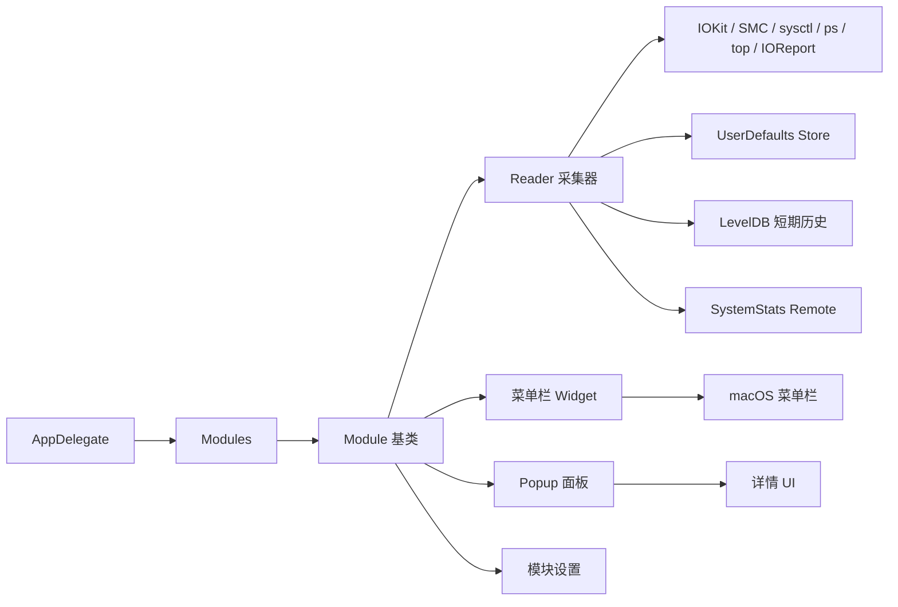
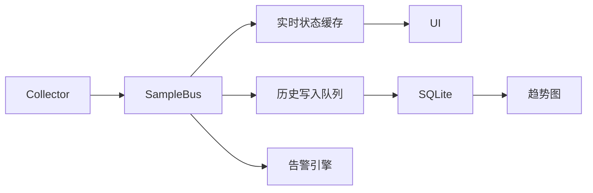

# Stats 功能梳理与源码分析

文档版本：v1.0  
分析对象：用户提供的 `stats-master.zip` 源码  
分析日期：2026-06-08  
适用项目：MacWatch

## 1. 项目概述

Stats 是一个运行在 macOS 菜单栏中的系统监控工具，核心目标是以低侵入方式展示本机硬件与系统资源状态。项目覆盖 CPU、GPU、内存、磁盘、网络、电池、传感器、蓝牙设备、时钟、远程监控等模块，并提供菜单栏小组件、弹出面板、通知、设置页、macOS Widget、远程监控和部分风扇控制能力。

从 MacWatch 的目标看，Stats 最有价值的部分包括：统一模块框架、统一采集 Reader、菜单栏 Widget 框架、硬件指标采集代码、SMC/IOKit/IOReport 数据读取经验、设置持久化机制、通知机制和系统兼容处理。Stats 原有的 LevelDB 历史数据能力偏短期缓存，不适合作为 MacWatch 的长期趋势记录主存储，需要改造成更稳定的时间序列存储。

## 2. 源码结构概览

Stats 源码主要由以下目录组成：

| 目录 | 作用 | 对 MacWatch 的价值 |
| --- | --- | --- |
| `Stats/` | App 入口、设置窗口、组合菜单、全局 UI 管理 | 可复用 App 生命周期、菜单栏管理、设置页思路 |
| `Kit/` | 公共框架，包括 Module、Reader、Widget、Popup、Store、DB、SystemKit、Repeater、Logger、Updater 等 | MacWatch 的核心架构参考层 |
| `Modules/` | 各监控模块，包括 CPU、RAM、Disk、Net、Battery、Sensors、GPU、Bluetooth、Clock、Remote | MacWatch 采集器的主要源码来源 |
| `SMC/` | SMC 命令行工具和 privileged helper，用于读取/写入 SMC、风扇控制 | 温度、风扇转速等硬件指标的关键基础能力 |
| `Widgets/` | macOS Widget Extension | 可作为 MacWatch 后续系统小组件参考 |
| `LaunchAtLogin/` | 登录启动辅助程序 | 可用于 MacWatch 登录启动功能 |

## 3. 全局架构

Stats 使用“模块化 + 采集器 + 菜单栏组件”的架构。App 启动时创建各模块实例，按用户设置决定是否挂载。每个模块继承统一 `Module` 基类，并拥有若干 `Reader` 负责数据采集，拥有若干 `Widget` 负责菜单栏显示，拥有 `Popup` 与 `Settings` 负责详情展示和配置。

核心链路如下：

### 3.1 AppDelegate

`Stats/AppDelegate.swift` 是应用入口。其职责包括：

- 初始化模块列表：CPU、GPU、RAM、Disk、Sensors、Network、Battery、Bluetooth、Clock、Remote。
- 启动时按模块顺序执行 `mount()`。
- 终止时执行每个模块的 `terminate()`，并关闭远程服务。
- 管理设置窗口、支持窗口、更新窗口、Setup 流程。
- 处理通知动作、全局快捷键、暂停监控、远程登录状态变化。
- 支持启动时自动更新检查、崩溃后状态恢复等。

### 3.2 Module 基类

`Kit/module/module.swift` 是所有模块的统一抽象。核心能力包括：

- 从模块 bundle 中读取 `config.plist`，得到模块名称、默认启用状态、可用 widget、设置项、预览能力。
- 维护模块状态：`enabled`、`available`、`menuBar`、`window`、`portal`、`popup`、`settings`、`notifications`、`readers`。
- 提供统一生命周期：`mount()`、`enable()`、`disable()`、`terminate()`。
- 根据 Popup、设置页、Preview 可见性动态启动或暂停相关 Reader，降低能耗。
- 响应全局通知，例如切换模块、切换 Popup、切换 Widget、打开详情窗口。

这套设计非常适合 MacWatch 继续使用，但 MacWatch 应将“历史记录”和“趋势分析”提升为一等能力，而不是只作为 Reader 的附加缓存。

### 3.3 Reader 基类

`Kit/module/reader.swift` 定义统一数据采集基类。核心能力包括：

- 每个 Reader 维护采集间隔、历史写入间隔、Popup/Preview/Sleep 状态。
- 使用 `Repeater` 定时执行 `read()`。
- 通过 callback 将采集结果发送给 UI、通知、远程服务和短期 DB。
- 从 Store 读取用户设置的刷新间隔。
- 支持 `start()`、`pause()`、`stop()`、`setInterval()`、`sleepMode()`。
- 支持按秒边界对齐，避免 UI 刷新漂移。

对 MacWatch 的启示：Reader 机制可复用，但需拆分为更明确的三类职责：实时采集、历史落库、UI 订阅。Stats 中 Reader 同时负责采集、UI 回调、DB 写入、远程发送，耦合度较高。

### 3.4 Widget 框架

`Kit/module/widget.swift` 提供多个菜单栏展示类型：

- `mini`
- `line_chart`
- `bar_chart`
- `pie_chart`
- `network_chart`
- `speed`
- `battery`
- `battery_details`
- `sensors`
- `memory`
- `label`
- `tachometer`
- `state`
- `text`

MacWatch 可沿用这种 Widget 类型体系，但需增加“历史记录入口”和“异常状态入口”，例如点击菜单栏温度直接进入该指标的历史曲线页面。

### 3.5 Store 与 DB

`Store` 是 UserDefaults 封装，负责用户设置、模块配置、导入导出配置。它使用内存 cache + UserDefaults 持久化。

`DB` 使用 LevelDB，存储最新值和短期历史。Stats 默认历史 TTL 约 1 小时，并且普通写入有最小间隔限制。它更适合作为菜单栏图表缓存，不适合作为 MacWatch 的长期历史库。

MacWatch 应保留 Store 作为设置存储，但历史数据建议改为 SQLite/GRDB 或 SwiftData。核心原因是：

- MacWatch 的主功能是记录变化过程，需要支持天、周、月级历史。
- SQLite 更适合时间范围查询、聚合、降采样和导出。
- LevelDB 适合键值读写，但不适合复杂历史查询和统计报表。

### 3.6 SystemKit

`Kit/plugins/SystemKit.swift` 负责识别设备信息，包括：

- CPU 架构：Intel、Apple Silicon M1/M2/M3/M4/M5 及 Pro/Max/Ultra 系列。
- 设备类型、型号、序列号、启动时间、macOS 版本。
- CPU 核心信息、GPU 信息、RAM、磁盘、显示器信息。
- CPU 核心类型：效率核、性能核、超高性能核等。

MacWatch 需要保留这部分，用于指标解释、兼容性判断、告警阈值默认值生成和导出报告中的设备档案。

### 3.7 SMC 与 Helper

`SMC/` 目录提供 SMC 命令行工具和 privileged helper。能力包括：

- 枚举 SMC keys。
- 读取温度、电压、电流、功率、风扇等 SMC 值。
- 读取风扇数量、风扇转速、风扇模式。
- 设置风扇模式和转速。
- 重置风扇控制。

MacWatch 的 MVP 建议只做只读监控，不默认提供风扇控制。风扇控制涉及 privileged helper、权限、安全责任和设备风险，可作为后续高级功能单独评估。

## 4. 模块功能梳理

## 4.1 CPU 模块

源码位置：`Modules/CPU/`

CPU 模块默认开启，提供 CPU 使用率、核心使用率、温度、频率、平均负载、限频状态、Top 进程等能力。

主要数据模型：

- `CPU_Load`：总使用率、每核心使用率、效率核/性能核/超高性能核使用率、系统态、用户态、空闲态。
- `CPU_Frequency`：CPU 频率，Apple Silicon 上区分 E-Core、P-Core、S-Core。
- `CPU_Limit`：Intel 平台上的调度器、CPU、速度限制。
- `CPU_AverageLoad`：1/5/15 分钟平均负载。

主要 Reader：

| Reader | 数据来源 | 功能 |
| --- | --- | --- |
| `LoadReader` | `host_processor_info`、`host_statistics` | 采集 CPU 总使用率、每核心使用率、系统/用户/空闲比例 |
| `ProcessReader` | `/bin/ps -Aceo pid,pcpu,comm -r` | 获取 CPU 占用最高的进程 |
| `TemperatureReader` | SMC keys；Apple Silicon 平台特定 key | 获取 CPU 温度 |
| `FrequencyReader` | IOReport CPU Stats / performance states | 获取 Apple Silicon CPU 频率 |
| `LimitReader` | `/usr/bin/pmset -g therm` | 获取 Intel 热限频状态 |
| `AverageLoadReader` | `/usr/bin/uptime` | 获取系统平均负载 |

MacWatch 可复用点：CPU 使用率采集、按核心统计、CPU 温度、CPU 频率、Top 进程。需要增强点：长期历史、温度趋势、过热告警、负载与温度关联分析。

## 4.2 RAM 模块

源码位置：`Modules/RAM/`

RAM 模块默认开启，提供内存占用、内存压力、Swap、Top 内存进程等能力。

主要数据模型：

- 总内存、已用、可用。
- Active、Inactive、Wired、Compressed。
- App 内存、Cache。
- Swap 总量、已用、可用。
- 内存压力级别和数值。
- Swap in/out。
- 内存使用率。

主要 Reader：

| Reader | 数据来源 | 功能 |
| --- | --- | --- |
| `UsageReader` | `host_info`、`host_statistics64`、`sysctlbyname` | 获取内存用量、内存压力、Swap 情况 |
| `ProcessReader` | `/usr/bin/top -l 1 -o mem` | 获取内存占用最高进程 |

MacWatch 可复用点：内存实时采集、内存压力状态、Swap 使用趋势。需要增强点：长期内存趋势、压力持续时间统计、异常进程快照。

## 4.3 Disk 模块

源码位置：`Modules/Disk/`

Disk 模块默认开启，提供磁盘容量、读写速率、Top I/O 进程、SMART 信息、硬盘温度等能力。

主要数据模型：

- 磁盘 UUID、BSD Name、挂载路径、文件系统、连接类型。
- 总容量、可用容量、已用比例。
- 读写速率、累计读写字节。
- SMART 温度、寿命、总读写量、通电次数、通电小时。

主要 Reader：

| Reader | 数据来源 | 功能 |
| --- | --- | --- |
| `CapacityReader` | FileManager、DiskArbitration、`statfs`、IORegistry、NVMe SMART | 枚举磁盘、容量、SMART 和温度 |
| `ActivityReader` | IORegistry `Statistics` | 根据累计读写字节差分计算实时读写速率 |
| `ProcessReader` | `ps` + `proc_pid_rusage` | 获取磁盘 I/O 高的进程 |

MacWatch 可复用点：磁盘空间监控、磁盘读写速率、NVMe SMART 温度。需要注意：并非所有磁盘都能读取 SMART 温度，外接盘、USB 盘、部分 SATA 盘可能不支持或需要额外权限/驱动。

## 4.4 Network 模块

源码位置：`Modules/Net/`

Network 模块默认开启，提供网络上下行速率、累计流量、IP、DNS、连接类型、Wi-Fi 信息、连通性检测、Top 网络进程等能力。

主要数据模型：

- 上行/下行速率。
- 累计上传/下载流量。
- 本地 IP、公网 IP、DNS。
- 当前接口、连接类型、连接状态。
- Wi-Fi SSID、BSSID、RSSI、噪声、PHY、安全类型、信道。
- 连通性状态、延迟、抖动。

主要 Reader：

| Reader | 数据来源 | 功能 |
| --- | --- | --- |
| `UsageReader` | SystemConfiguration、`getifaddrs`、CoreWLAN、Reachability、公网 IP API | 网络接口、速率、IP、Wi-Fi 信息 |
| `ProcessReader` | `nettop` | 进程级网络流量 |
| `ConnectivityReader` | ICMP 或 HTTP HEAD | 网络延迟、抖动和连通性 |

MacWatch 可将网络模块列为可选功能。MacWatch 的核心目标是硬件温度和资源变化，因此网络不是 MVP 必须项，但可用于完整系统监控。

## 4.5 Battery 模块

源码位置：`Modules/Battery/`

Battery 模块默认开启，提供电池电量、充放电状态、循环次数、健康度、容量、电压、电流、温度、电源适配器功率、预计剩余时间、高能耗进程等能力。

主要数据模型：

- 电源来源：电池/AC。
- 电池状态：充电、放电、已充满、电池供电、优化充电。
- 电量百分比、循环次数、健康状态。
- 设计容量、最大容量、当前容量。
- 电流、电压、温度。
- AC 适配器功率、充电电流、充电电压。
- 剩余使用时间、充满时间、接入 AC 时间。

主要 Reader：

| Reader | 数据来源 | 功能 |
| --- | --- | --- |
| `UsageReader` | IOPowerSources、IORegistry `AppleSmartBattery`、External Power Adapter | 电池状态、健康、容量、温度、电流电压 |
| `ProcessReader` | `/usr/bin/top -o power` | 获取高能耗进程 |

MacWatch 可复用点：电池温度、电池健康、电量与充放电历史、功耗趋势。需要增强点：电池温度历史、充电曲线、健康衰减趋势、异常充电告警。

## 4.6 Sensors 模块

源码位置：`Modules/Sensors/`

Sensors 模块默认关闭，但对 MacWatch 价值最高。它负责统一读取温度、电压、电流、功率、能耗、风扇等底层传感器。

传感器类型：

- Temperature
- Voltage
- Current
- Power
- Energy
- Fans

传感器分组：

- CPU
- GPU
- Systems
- Sensors
- HID
- Unknown

主要能力：

- 从 SMC 枚举和读取温度、电压、电流、功率 key。
- Apple Silicon 上读取 HID sensors。
- Apple Silicon 上通过 IOReport `Energy Model` 估算 CPU/GPU/ANE/RAM/PCI 功耗。
- 读取风扇数量、转速、最小/最大转速、模式。
- 计算派生传感器，例如 Average CPU、Hottest CPU、Average GPU、Hottest GPU、Fastest Fan、Total System Consumption。
- 支持隐藏未知传感器、选择传感器展示、阈值通知。

MacWatch 可复用点：底层温度/功耗/风扇采集框架、传感器模型、派生指标。需要增强点：传感器命名标准化、跨机型适配表、历史存储、异常值过滤策略、设备兼容报告。

## 4.7 GPU 模块

源码位置：`Modules/GPU/`

GPU 模块默认关闭，提供 GPU 使用率、渲染/瓦片利用率、温度、风扇、频率、ANE 利用率、FPS 等能力。

主要数据模型：

- GPU ID、类型、IOClass、厂商、型号、核心数。
- 状态、风扇速度、核心频率、显存频率。
- 温度、GPU 使用率、Renderer 使用率、Tiler 使用率、ANE 使用率、FPS。

主要数据来源：

- IORegistry `IOAccelerator` PerformanceStatistics。
- SMC 温度 fallback。
- Apple Silicon IOReport Energy Model。
- DCP swap channels 估算 FPS。

MacWatch 可将 GPU 作为增强模块。对于 Apple Silicon 设备，GPU 温度和功耗趋势与系统热管理强相关，建议在 MVP+ 阶段纳入。

## 4.8 Bluetooth 模块

源码位置：`Modules/Bluetooth/`

Bluetooth 模块默认关闭，提供蓝牙设备连接状态、RSSI、电量等能力。

数据来源包括：

- CoreBluetooth 扫描。
- IOBluetooth 已配对设备。
- IORegistry HID 设备。
- `system_profiler SPBluetoothDataType`。
- `pmset -g accps -xml` 获取附件电池。

该模块对 MacWatch 核心目标不是必需，可作为后续外设监控能力。

## 4.9 Clock 模块

源码位置：`Modules/Clock/`

Clock 模块默认关闭，提供多时区时钟显示。该模块与 MacWatch 核心监控目标无直接关系，不建议纳入 MVP。

## 4.10 Remote 模块与 SystemStats

Remote 模块默认关闭，用于外部远程监控/控制。`Reader` 在 callback 时可通过 `SystemStats.shared.send(key:value)` 发送实现 `RemoteType` 的指标。

MacWatch 如果面向本地隐私监控，MVP 不建议启用外部远程服务。若后续需要远程查看，建议明确采用端到端加密、用户显式授权、可关闭、可审计的设计。

## 5. 设置、Popup、通知与组合菜单

Stats 提供完整设置体系，包括：

- 各模块启用/禁用。
- 模块菜单栏 Widget 类型选择。
- Widget 显示样式、颜色、阈值、标题、单位、刷新间隔。
- Popup 详情内容。
- 通知阈值。
- 登录启动。
- Dock 图标显示。
- 温度单位。
- 设置导入/导出/重置。
- macOS Widgets。
- 组合模块：把多个模块 Widget 合并为一个菜单栏 item。

MacWatch 应继承这些思路，但应简化第一版设置，优先保证“监控准确、记录可靠、趋势清晰”。组合菜单可作为后续体验优化。

## 6. Stats 对 MacWatch 的可复用清单

| 能力 | 建议复用程度 | 说明 |
| --- | --- | --- |
| Module/Reader 生命周期 | 高 | 是 Stats 最成熟的抽象之一，但需拆分历史存储职责 |
| CPU 采集 | 高 | CPU 使用率、核心统计、温度、频率可直接参考 |
| RAM 采集 | 高 | VM statistics 和内存压力读取成熟 |
| Disk 采集 | 高 | 容量、I/O、NVMe SMART 温度有直接价值 |
| Battery 采集 | 高 | 电池温度、健康、容量、充放电状态是 MacWatch 核心指标 |
| Sensors 采集 | 高 | 温度、功耗、风扇、Apple Silicon 适配关键 |
| GPU 采集 | 中高 | 建议作为增强模块纳入 |
| Network 采集 | 中 | 可选，不是核心温度监控必需 |
| Bluetooth/Clock | 低 | 与 MacWatch 核心定位弱相关 |
| Store 设置 | 高 | 可复用，但需规范 key 命名和版本迁移 |
| LevelDB 历史 | 低 | 只适合短期缓存，不适合长期趋势主库 |
| Remote | 低 | MVP 不建议启用外部远程服务 |
| 风扇控制 | 低 | 风险高，建议只读风扇监控，不做控制 |
| macOS Widgets | 中 | 后续增强，可暂缓 |

## 7. 需要重点改造的地方

### 7.1 从“实时菜单栏工具”改造为“历史监控工具”

Stats 的核心体验是实时显示。MacWatch 的核心体验是“记录变化过程”。因此必须新增：

- 长期时间序列存储。
- 趋势图查询与聚合。
- 数据保留策略。
- 导出能力。
- 异常事件记录。
- 按时间范围回放硬件状态。

### 7.2 存储架构重构

Stats 使用 LevelDB 作为短期历史缓存，TTL 默认约 1 小时。MacWatch 应使用 SQLite/GRDB 或 SwiftData 作为主存储，并设计统一 `metric_sample` 表。

### 7.3 指标命名标准化

Stats 各模块的数据模型较独立。MacWatch 应设计统一指标命名，例如：

- `cpu.usage.total`
- `cpu.temperature.average`
- `cpu.temperature.hottest`
- `memory.usage.percent`
- `disk.io.read_bytes_per_sec`
- `disk.temperature.smart`
- `battery.temperature`
- `battery.level`
- `sensor.fan.fastest_rpm`

### 7.4 采样与落库解耦

Stats 的 Reader callback 会同时更新 UI、DB、远程服务。MacWatch 应改为：

### 7.5 隐私与网络能力收敛

Stats 有更新检查、公网 IP 查询、远程监控 API。MacWatch 若主打本地监控，应默认不上传任何硬件指标。所有联网能力必须显式授权。

## 8. 对 MacWatch 的总体结论

Stats 已经提供了 macOS 硬件与资源监控所需的大部分底层能力，尤其是 CPU、RAM、Disk、Battery、Sensors、GPU 相关实现。MacWatch 可以基于 Stats 的采集代码和模块化架构快速落地，但不能简单复制 Stats，因为产品重心不同：Stats 偏“菜单栏实时显示”，MacWatch 偏“温度与资源变化记录”。

MacWatch 的核心技术工作应集中在以下方向：

1. 复用 Stats 的硬件采集能力。
2. 设计统一指标模型。
3. 建立长期历史数据库。
4. 构建趋势图、筛选、导出和异常事件记录。
5. 保持菜单栏实时监控轻量化。
6. 默认本地化、隐私优先，远程能力后置。
