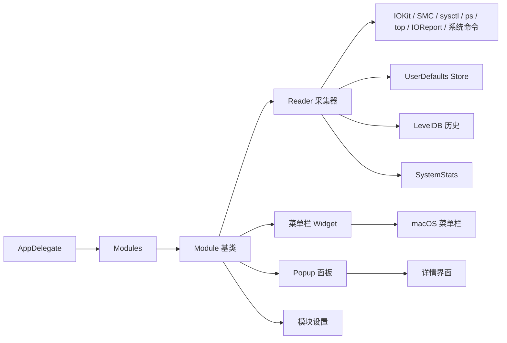

# Stats 功能梳理（事实版）

## 索引目录（大模型检索用）

> 使用方式：先按本索引定位需要章节，再只读取对应标题下的片段，避免把整篇文档塞入上下文。

- [文档元信息](#stats-功能梳理事实版)：查看分析对象、修订日期、核验基础和事实限定说明。
- [1. 项目概述](#1-项目概述)：快速理解 Stats 的整体能力范围、模块化方式和 LevelDB 历史机制。
- [2. 源码结构概览](#2-源码结构概览)：定位 Stats 源码目录和文件职责时读取。
- [3. 全局架构](#3-全局架构)：理解 Stats 的 AppDelegate、Module、Reader、Widget、Store、DB、SystemKit、SMC helper 链路时读取。
  - [3.1 AppDelegate](#31-appdelegate)：查看 Stats 启动和模块挂载事实。
  - [3.2 Module 基类](#32-module-基类)：理解模块如何组合 Reader、Widget、Popup、设置和通知。
  - [3.3 Reader 基类](#33-reader-基类)：理解采集器抽象、更新节奏和历史写入条件。
  - [3.4 Widget 框架](#34-widget-框架)：确认菜单栏 Widget 结构和 UI 责任。
  - [3.5 Store 与 DB](#35-store-与-db)：确认 Stats 内部状态存储和 LevelDB 历史机制。
  - [3.6 SystemKit](#36-systemkit)：查找设备识别、系统信息和 Apple Silicon 判断事实。
  - [3.7 SMC 与 Helper](#37-smc-与-helper)：确认 SMC、helper、风扇控制和权限相关事实。
- [4. 模块功能梳理](#4-模块功能梳理)：按模块查找 Stats 可参考能力和不应复用的能力。
  - [4.1 CPU 模块](#41-cpu-模块)：查找 CPU 采集、温度或负载相关实现线索。
  - [4.2 RAM 模块](#42-ram-模块)：查找内存监控、压力和 swap 相关实现线索。
  - [4.3 Disk 模块](#43-disk-模块)：查找磁盘、SMART、空间和 I/O 相关实现线索。
  - [4.4 Network 模块](#44-network-模块)：确认网络监控、外部 IP 和联网能力事实。
  - [4.5 Battery 模块](#45-battery-模块)：查找电池温度、IORegistry 和电池状态实现线索。
  - [4.6 Sensors 模块](#46-sensors-模块)：查找 HID Sensors、SMC 传感器和温度读取实现线索。
  - [4.7 GPU 模块](#47-gpu-模块)：查找 GPU 指标和 IOReport 相关实现线索。
  - [4.8 Bluetooth 模块](#48-bluetooth-模块)：确认蓝牙设备监控能力事实。
  - [4.9 Clock 模块](#49-clock-模块)：确认时钟模块能力事实。
  - [4.10 Remote 模块与 SystemStats](#410-remote-模块与-systemstats)：确认远程监控、外部服务和系统状态上报事实。
- [5. 设置、Popup、通知与组合菜单](#5-设置popup通知与组合菜单)：查找 Stats UI 组合、设置、通知和菜单行为事实。

文档版本：v1.0  
分析对象：`/Users/lzc/TNTprojectZ/AprojectZ/MacWatch/Vendor/Stats` 源码  
修订日期：2026-06-09  
核验基础：`Stats_功能梳理_源码核验报告.md`

> 说明：本文只保留能从 Stats 源码或核验报告直接支撑的事实。涉及平台、驱动、权限、设备类型差异的能力，会在对应位置补充限定语。

## 1. 项目概述

Stats 是一个运行在 macOS 菜单栏中的系统监控工具，覆盖 CPU、GPU、内存、磁盘、网络、电池、传感器、蓝牙、时钟和远程相关模块。源码中还能看到菜单栏 Widget、Popup、通知、设置页、macOS Widget Extension、登录启动辅助程序，以及基于 `SMC` helper 的部分风扇控制能力。

从实现上看，Stats 采用模块化结构组织功能：应用入口负责挂载模块，模块负责组合 Reader、Widget、Popup、设置页和通知逻辑，不同 Reader 再分别读取 IOKit、SMC、sysctl、IOReport、系统命令或外部服务返回的数据。

源码中还包含一套基于 LevelDB 的短期历史机制。`Kit/plugins/DB.swift` 中可见历史数据 TTL 为 1 小时，普通写入存在 30 秒节流，Reader 侧是否写入历史还受 `history` 标志和采样节奏控制。

## 2. 源码结构概览

Stats 源码主要由以下目录组成：

| 目录 | 作用 |
| --- | --- |
| `Stats/` | App 入口、设置窗口、组合菜单、全局 UI 管理 |
| `Kit/` | 公共框架，包括 `Module`、`Reader`、`Widget`、`Popup`、`Store`、`DB`、`SystemKit`、`Repeater`、`Logger`、`Updater` 等 |
| `Modules/` | 各监控模块，包括 `CPU`、`RAM`、`Disk`、`Net`、`Battery`、`Sensors`、`GPU`、`Bluetooth`、`Clock`、`Remote` |
| `SMC/` | SMC 命令行工具与 privileged helper，用于读取和部分写入 SMC 数据 |
| `Widgets/` | macOS Widget Extension |
| `LaunchAtLogin/` | 登录启动辅助程序 |

这些目录与源码中的实际文件对应关系明确，例如 `Stats/AppDelegate.swift`、`Kit/module/module.swift`、`Modules/CPU/main.swift`、`SMC/Helper/main.swift`、`Widgets/UnitedWidget.swift`、`LaunchAtLogin/main.swift`。

## 3. 全局架构

Stats 采用“模块 + Reader + 菜单栏组件”的架构。应用启动后创建模块实例，模块内部再组合 Reader、Widget、Popup、设置页与通知视图。

核心链路可概括为：

### 3.1 AppDelegate

`Stats/AppDelegate.swift` 是应用入口，主要职责包括：

- 初始化模块列表：`CPU`、`GPU`、`RAM`、`Disk`、`Sensors`、`Net`、`Battery`、`Bluetooth`、`Clock`、`Remote`
- 启动时按顺序调用各模块的 `mount()`
- 退出时调用各模块的 `terminate()`，并停止远程相关流程
- 管理设置、支持、更新与 Setup 等窗口
- 处理通知代理、全局和本地按键监听、暂停监控、远程登录状态变化
- 初始化更新检查，更新地址指向 `https://api.mac-stats.com/release/latest`

本次核验中没有看到“崩溃后状态恢复”的明确实现，因此本文不保留该表述。

### 3.2 Module 基类

`Kit/module/module.swift` 定义了统一的模块抽象。其核心能力包括：

- 从模块 bundle 的 `config.plist` 读取模块名称、默认启用状态、可用 Widget、设置项等
- 维护模块状态，例如 `enabled`、`available`、`menuBar`、`window`、`popup`、`settings`、`notifications`、`readers`
- 提供 `mount()`、`enable()`、`disable()`、`terminate()` 等统一生命周期
- 根据 popup 和 preview/window 的打开状态，影响部分 Reader 的暂停与唤醒
- 监听并响应模块切换、Popup 切换、Widget 切换、详情窗口打开等通知

各模块默认开启或关闭状态来自各自 `config.plist` 的 `State` 字段，并在 `Module` 初始化时读入。

### 3.3 Reader 基类

`Kit/module/reader.swift` 定义了统一的数据采集基类。其核心行为包括：

- 维护采样间隔、popup/preview/sleep 状态
- 使用 `Repeater` 周期性执行 `read()`
- 从 Store 读取刷新间隔并支持 `start()`、`pause()`、`stop()`、`setInterval()`、`sleepMode()`
- 在回调中触发模块传入的 callback，并调用 `SystemStats.shared.send(...)` 与 `DB.shared.insert(...)`
- 支持按秒边界对齐，减少定时漂移

需要区分的是：Reader 基类会触发模块 callback，但并不是 Reader 直接操作 UI。UI 更新通常发生在模块初始化 Reader 时传入的 callback 内部。

### 3.4 Widget 框架

`Kit/module/widget.swift` 中定义了多种菜单栏展示类型：

- `mini`
- `line_chart`
- `bar_chart`
- `pie_chart`
- `network_chart`
- `speed`
- `battery`
- `battery_details`
- `sensors`
- `memory`
- `label`
- `tachometer`
- `state`
- `text`

其中源码内部对应 `sensors` 的 case 名为 `stack`，其 `rawValue` 为 `"sensors"`。

### 3.5 Store 与 DB

`Store` 是对 UserDefaults 的封装，负责保存用户设置、模块配置以及导入、导出、重置逻辑，并带有内存缓存。

`DB` 是 LevelDB 封装，负责保存最新值和带时间戳的历史记录。依据 `Kit/plugins/DB.swift` 与 `Kit/module/reader.swift`，当前实现至少包含以下事实：

- 历史 TTL 为 1 小时
- 普通键值写入存在 30 秒节流
- 历史写入会生成带时间戳的 key
- 历史是否写入以及写入节奏还受 Reader 侧 `history` 标志与采样周期控制

### 3.6 SystemKit

`Kit/plugins/SystemKit.swift` 负责识别设备与平台信息，包括：

- CPU 架构与平台分类：Intel、Apple Silicon M1-M5 及 Pro/Max/Ultra 系列
- 机型、序列号、启动时间、macOS 版本
- CPU、GPU、RAM、磁盘、显示器等基础硬件信息
- CPU 核心分组信息，例如效率核、性能核与更高性能分组

这部分逻辑既包含平台枚举，也包含各类设备信息结构体与初始化流程。

### 3.7 SMC 与 Helper

`SMC/` 目录包含 SMC CLI 与 privileged helper。源码中可以直接看到以下能力：

- 枚举 SMC keys
- 读取温度、电压、电流、功率、风扇等 SMC 值
- 读取风扇数量、转速、模式
- 设置风扇模式与转速
- 重置风扇控制

风扇控制依赖 `SMC` helper，相关安装与控制界面也在 `Modules/Sensors/popup.swift` 中有对应实现。

## 4. 模块功能梳理

### 4.1 CPU 模块

源码位置：`Modules/CPU/`  
默认状态：开启

CPU 模块提供 CPU 使用率、每核心负载、温度、频率、平均负载、限频状态与高占用进程等信息。部分字段是否可用，取决于平台以及 IOReport/SMC 能否提供对应数据。

主要数据模型包括：

- `CPU_Load`：总使用率、每核心使用率、系统态、用户态、空闲态
- `CPU_Frequency`：CPU 频率；Apple Silicon 上可区分不同核心分组
- `CPU_Limit`：Intel 平台上的热限制相关状态
- `CPU_AverageLoad`：1/5/15 分钟平均负载

主要 Reader：

| Reader | 数据来源 | 功能 |
| --- | --- | --- |
| `LoadReader` | `host_processor_info`、`host_statistics` | 采集总使用率、每核心使用率以及系统/用户/空闲比例 |
| `ProcessReader` | `/bin/ps -Aceo pid,pcpu,comm -r` | 获取 CPU 占用最高的进程 |
| `TemperatureReader` | SMC keys 与平台相关 key | 获取 CPU 温度 |
| `FrequencyReader` | IOReport | 获取 CPU 频率 |
| `LimitReader` | `/usr/bin/pmset -g therm` | 获取 Intel 热限制状态 |
| `AverageLoadReader` | `/usr/bin/uptime` | 获取系统平均负载 |

### 4.2 RAM 模块

源码位置：`Modules/RAM/`  
默认状态：开启

RAM 模块提供内存占用、内存压力、Swap 与高内存占用进程等信息。

主要数据模型包括：

- 总内存、已用、可用
- `Active`、`Inactive`、`Wired`、`Compressed`
- App 内存、缓存
- Swap 总量、已用、可用
- 内存压力级别与数值
- Swap in/out
- 内存使用率

主要 Reader：

| Reader | 数据来源 | 功能 |
| --- | --- | --- |
| `UsageReader` | `host_info`、`host_statistics64`、`sysctlbyname` | 获取内存用量、内存压力与 Swap 情况 |
| `ProcessReader` | `/usr/bin/top -l 1 -o mem` | 获取内存占用最高进程 |

### 4.3 Disk 模块

源码位置：`Modules/Disk/`  
默认状态：开启

Disk 模块提供磁盘容量、活动速率、进程级 I/O 以及部分 SMART 相关信息。SMART 温度、寿命等字段是否可用，受磁盘类型、连接方式、驱动与权限影响。

主要数据模型包括：

- 磁盘 UUID、BSD Name、挂载路径、文件系统、连接类型
- 总容量、可用容量、已用比例
- 读写速率、累计读写字节
- 部分磁盘的 SMART 温度、寿命、总读写量、通电次数、通电小时

主要 Reader：

| Reader | 数据来源 | 功能 |
| --- | --- | --- |
| `CapacityReader` | `FileManager`、`DiskArbitration`、`statfs`、IORegistry、NVMe SMART | 枚举磁盘并读取容量与部分 SMART 信息 |
| `ActivityReader` | IORegistry `Statistics` | 根据累计读写字节差分计算实时读写速率 |
| `ProcessReader` | 进程 API 与系统命令 | 获取磁盘活跃进程 |

### 4.4 Network 模块

源码位置：`Modules/Net/`  
默认状态：开启

Network 模块提供上下行速率、累计流量、IP、DNS、连接状态、Wi-Fi 信息、连通性检测与进程级网络流量等信息。不同接口、网络类型与系统权限会影响具体字段可用性。

主要数据模型包括：

- 上行/下行速率
- 累计上传/下载流量
- 本地 IP、公网 IP、DNS
- 当前接口、连接类型、连接状态
- Wi-Fi `SSID`、`BSSID`、`RSSI`、噪声、PHY、安全类型、信道
- 连通性状态、延迟、抖动

主要 Reader：

| Reader | 数据来源 | 功能 |
| --- | --- | --- |
| `UsageReader` | `SystemConfiguration`、`getifaddrs`、`CoreWLAN`、Reachability、外部公网 IP API | 获取接口、速率、IP、DNS 与 Wi-Fi 信息 |
| `ProcessReader` | `nettop` | 获取进程级网络流量 |
| `ConnectivityReader` | 模块内部连通性检测逻辑 | 获取连通性、延迟与抖动 |

其中公网 IP 查询会直接调用外部接口 `https://api.mac-stats.com/ip`。

### 4.5 Battery 模块

源码位置：`Modules/Battery/`  
默认状态：开启

Battery 模块提供电池状态、容量、健康、温度、电流、电压、电源适配器信息、预计时间与高能耗进程等数据。相关字段仅在带电池设备上可用。

主要数据模型包括：

- 电源来源：电池或 AC
- 电池状态：充电、放电、已充满、电池供电、优化充电等
- 电量百分比、循环次数、健康状态
- 设计容量、最大容量、当前容量
- 电流、电压、温度
- AC 适配器功率、充电电流、充电电压
- 剩余使用时间、充满时间、接入 AC 时间

主要 Reader：

| Reader | 数据来源 | 功能 |
| --- | --- | --- |
| `UsageReader` | `IOPSCopyPowerSourcesInfo`、IORegistry `AppleSmartBattery`、`External Power Adapter` | 获取电池状态、健康、容量、温度、电流电压等信息 |
| `ProcessReader` | `/usr/bin/top -o power` | 获取高能耗进程 |

### 4.6 Sensors 模块

源码位置：`Modules/Sensors/`  
默认状态：关闭

Sensors 模块统一读取温度、电压、电流、功率、能耗与风扇相关传感器。不同传感器是否存在，以及命名和分组方式，取决于平台、机型、驱动和底层接口可用性。

传感器类型包括：

- `Temperature`
- `Voltage`
- `Current`
- `Power`
- `Energy`
- `Fans`

传感器分组包括：

- `CPU`
- `GPU`
- `Systems`
- `Sensors`
- `HID`
- `Unknown`

主要能力包括：

- 从 SMC 枚举并读取温度、电压、电流、功率等 key
- 在 Apple Silicon 上读取 HID sensors
- 在 Apple Silicon 上通过 IOReport `Energy Model` 估算 CPU/GPU/ANE/RAM/PCI 功耗
- 读取风扇数量、转速、最小/最大转速与模式
- 计算派生传感器，例如 `Average CPU`、`Hottest CPU`、`Average GPU`、`Hottest GPU`、`Fastest Fan`、`Total System Consumption`
- 支持隐藏未知传感器、选择展示项与阈值通知

### 4.7 GPU 模块

源码位置：`Modules/GPU/`  
默认状态：关闭

GPU 模块提供 GPU 使用率、渲染/瓦片利用率、温度、风扇、频率、ANE 相关指标与 FPS 估算等信息，但这些字段明显依赖平台、驱动以及 `PerformanceStatistics`、IOReport 等底层数据源是否可用。

主要数据模型包括：

- GPU ID、类型、`IOClass`、厂商、型号、核心数
- 状态、风扇速度、核心频率、显存频率
- 温度、GPU 使用率、Renderer 使用率、Tiler 使用率、ANE 使用率、FPS

主要数据来源包括：

- IORegistry `IOAccelerator` `PerformanceStatistics`
- SMC 温度 fallback
- Apple Silicon IOReport `Energy Model`
- DCP swap channels 的 FPS 估算逻辑

### 4.8 Bluetooth 模块

源码位置：`Modules/Bluetooth/`  
默认状态：关闭

Bluetooth 模块读取蓝牙设备相关信息，但具体能看到哪些设备、状态或电量字段，取决于系统可探测设备及数据源返回内容。

源码中使用的主要来源包括：

- `CoreBluetooth`
- `IOBluetooth`
- `system_profiler SPBluetoothDataType`
- `pmset -g accps -xml`

### 4.9 Clock 模块

源码位置：`Modules/Clock/`  
默认状态：关闭

Clock 模块的核心能力是多时区时间显示，核心 Reader 为 `ClockReader`。

### 4.10 Remote 模块与 SystemStats

源码位置：`Modules/Remote/`、`Kit/plugins/SystemStats.swift`  
默认状态：关闭

Remote 相关实现并不只是一个本地“远程接口预留”。当前源码已经接入 System Stats 云服务，包含 OAuth、MQTT、设备注册、主机与远程机器列表等流程。

`Reader.callback(_:)` 中会把实现 `RemoteType` 的值通过 `SystemStats.shared.send(...)` 发送出去。`SystemStats.swift` 中可直接看到的外部域名包括：

- `api.system-stats.com`
- `oauth.system-stats.com`
- `broker.system-stats.com`
- `app.system-stats.com`

因此，Remote 模块和部分 Reader 输出与外部联网能力存在直接关系。

## 5. 设置、Popup、通知与组合菜单

Stats 的设置覆盖面较广，源码中可以直接看到的配置范围包括：

- 各模块启用与禁用
- 模块菜单栏 Widget 类型选择
- Widget 显示样式、颜色、阈值、标题、单位、刷新间隔
- Popup 详情内容
- 通知阈值
- 登录启动
- Dock 图标显示
- 温度单位
- 设置导入、导出、重置
- macOS Widgets
- 组合模块
- Remote 相关设置

与这些设置相关的事实实现包括：

- `Stats/Views/AppSettings.swift` 中包含温度、Dock、启动项、macOS Widgets、组合模块、Remote、导入导出重置等设置入口
- `Kit/plugins/Store.swift` 中包含 `export`、`import`、`reset`
- `Stats/Views/CombinedView.swift` 中实现了组合菜单项、组合 Popup 与点击行为

Popup、通知与菜单栏展示通常由模块层组合各个 Reader 的输出后驱动，不同模块会把 callback 分发到 Widget、Popup、Settings 或 Notifications 视图。

---

本文到此为止，仅覆盖 Stats 源码事实，不包含面向 MacWatch 的复用评估、后续改造方向或产品结论。
